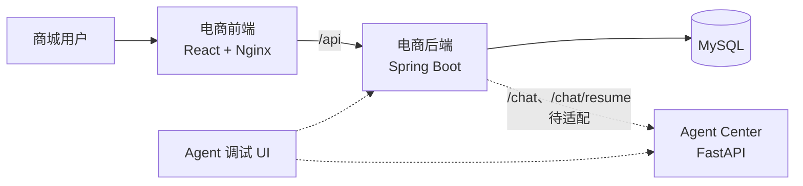

# Xiaozhe Agent Center

小哲电商与 Agent Center 的统一代码仓库。电商前端、电商后端和 Agent Center 保持独立构建与部署，通过 HTTP API 协作。

> 当前状态：电商前后端已经完成拆分并可独立运行；现有 Agent Center 仍使用天机课程协议，尚未实现小哲电商客服所需的 Agent 接口。

## 系统架构



电商后端负责登录态、用户身份、订单归属和高风险操作校验。Agent 应通过受保护的业务 API 使用数据，不应直接访问电商数据库。

## 项目目录

| 目录 | 职责 | 默认端口 | 文档 |
| --- | --- | --- | --- |
| `agent-center/` | Python/FastAPI Agent 服务 | `18089` | [Agent Center](agent-center/README.md) |
| `ecommerce-backend/` | Spring Boot 电商 API | `8081` | [电商后端](ecommerce-backend/README.md) |
| `ecommerce-frontend/` | 商城前台与管理后台 | `5174` | [电商前端](ecommerce-frontend/README.md) |
| `agent-debug-ui/` | Agent 调试、轨迹与评测界面 | `5173` | [调试 UI](agent-debug-ui/README.md) |
| `deploy/` | 电商本地容器编排 | - | [部署说明](deploy/README.md) |

## 快速启动电商应用

前置条件：Docker Desktop 已启动，`3306`、`8081` 和 `5174` 端口可用。

```powershell
Copy-Item .env.example .env
# 编辑 .env，至少替换 MYSQL_ROOT_PASSWORD 和 AGENT_SERVICE_AUTH_TOKEN
docker compose --env-file .env -f deploy/docker-compose.yml up --build -d
```

启动后可访问：

| 入口 | 地址 |
| --- | --- |
| 商城 | <http://localhost:5174> |
| 管理后台 | <http://localhost:5174/admin> |
| 后端健康检查 | <http://localhost:8081/actuator/health> |
| Knife4j API 文档 | <http://localhost:8081/doc.html> |

演示账号：

| 角色 | 用户名 | 密码 |
| --- | --- | --- |
| 普通用户 | `zhangsan`、`lisi` 或 `wangwu` | `123456` |
| 管理员 | `admin` | `admin123456` |

这些账号仅用于本地课程和联调环境，不得用于生产部署。

## 本地开发

各项目可以分别启动：

```powershell
# 电商后端
Set-Location ecommerce-backend
$env:SPRING_DATASOURCE_URL = "jdbc:mysql://localhost:3306/agent_demo?useUnicode=true&characterEncoding=utf8&serverTimezone=Asia/Shanghai"
$env:SPRING_DATASOURCE_USERNAME = "root"
$env:SPRING_DATASOURCE_PASSWORD = "your-password"
$env:AGENT_SERVICE_AUTH_TOKEN = "your-service-token"
mvn spring-boot:run

# 电商前端
Set-Location ..\ecommerce-frontend
npm ci
npm run dev

# Agent 调试 UI
Set-Location ..\agent-debug-ui
npm ci
npm run dev
```

以上后端命令要求本机 MySQL 已创建 `agent_demo` 数据库；完整启动说明参见[电商后端文档](ecommerce-backend/README.md)。Agent Center 依赖独立的 Conda 环境和外部基础设施，参见 [Agent Center 文档](agent-center/README.md)。

## 配置

仓库根目录的 `.env.example` 是统一配置模板：

- `MYSQL_*`：电商 MySQL 配置。
- `ECOMMERCE_*_PORT`：电商前后端宿主机端口。
- `AGENT_SERVICE_*`：电商后端与未来小哲 Agent 的服务配置。
- `AGENT_CENTER_*`：Agent Center 的数据库、Redis、JWT、模型服务、PostgreSQL 和 Nacos 配置。

本地 `.env` 已被 Git 忽略。禁止提交真实密码、API Key、JWT 私钥或服务令牌。

## 构建与测试

| 项目 | 命令 | 当前基线 |
| --- | --- | --- |
| Agent Center | `conda run -n ac_env_3135 python -m unittest discover -s tests -v` | 21 个测试通过 |
| 电商后端 | `mvn test` | 构建通过，暂未提供 Java 测试用例 |
| 电商前端 | `npm ci && npm run build` | TypeScript/Vite 构建通过 |
| Agent 调试 UI | `npm ci && npm run build` | TypeScript/Vite 构建通过 |

## Agent 集成边界

电商后端当前期望 Agent 提供普通 JSON 接口 `/chat` 和 `/chat/resume`。现有 Agent Center 的 `/chat` 使用另一套请求模型并返回 SSE，因此二者暂时不兼容。

后续实现小哲 Agent 时，需要同时确定：

1. 商城客服聊天与人工确认恢复协议。
2. Agent 调用电商 API 时使用的 `X-Agent-Service-Token` 和 `X-Agent-User-Id` 请求头。
3. 会话、工作流、审批和失败降级策略。
4. 调试 UI 所需的能力、轨迹、评测和反馈接口。

接口未接通期间，商城客服入口会使用后端已有的降级响应，其他电商功能不受影响。
