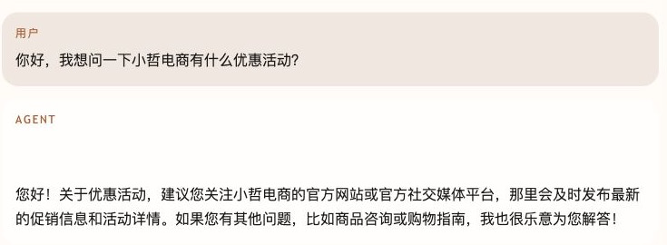
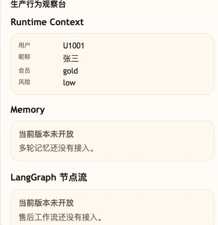

# 第 02 课代码：Agent 对话接口｜`/chat` 后端服务

这一版代码只验证一件事：小哲电商客服 Agent 已经有了稳定的 `/chat` 入口。电商系统或独立的小哲电商客服 Agent 调试后台，都可以通过 `http://localhost:8000/chat` 调用这一版 Agent。

它不是最终 Agent：

- 不读取活动规则或售后政策。
- 不调用订单、物流、库存等业务接口。
- 不做退款、退货或人工审批。
- 不保证业务回答正确。
- 不包含调试后台页面代码；调试后台是独立共享工具，只通过 Agent 地址调用这一版服务。

## 和调试后台的关系

课程里的每个 `agent-course-versions/lesson-xx-*/backend` 都只是一版 Agent 后端。小哲电商客服 Agent 调试后台是根目录 `frontend/` 下的独立工具，通过目标 Agent 地址调用当前课程版本。

默认情况下，这一课监听：

```text
http://localhost:8000
```

如果调试后台使用默认配置，它会请求 `http://localhost:8000/chat`。如果你把这一课的 Agent 跑到其他端口，就把调试后台的 `VITE_AGENT_BASE_URL` 指向新的地址。调试后台如何适配不同 Agent 版本，由运行手册说明。

## 核心文件

```text
lesson-02-chat-service/
  backend/
    api/
      routes.py
      schemas.py
    agents/
      customer_service_agent.py
    config/
      settings.py
    models/
      llm_client.py
    main.py
```

本课新增的工程分层很少：`main.py` 只负责组装 FastAPI 应用，`api/` 只做接口进出，`agents/` 才放最小 Agent 编排。这样下一课可以继续往 Agent 里加能力，而不是继续把所有逻辑塞进入口文件。

## 启动后端

```bash
cd agent-course-versions/lesson-02-chat-service/backend
python main.py
```

后端默认运行在：

```text
http://localhost:8000
```

## 验证重点

你可以用独立调试后台、商城客服网关或 curl 发送：

```text
你好，我想问一下小哲电商有什么优惠活动？
```

你应该能看到：

- 请求打到 `POST http://localhost:8000/chat`。
- 请求体包含 `session_id`、`runtime_user_id`、`runtime_member_level`、`runtime_risk_level`、`user_message`。
- 响应体包含 `session_id`、`answer`、`session_state`。
- 响应体不包含后续版本才会出现的引用、工具调用或评测证据字段。

curl 示例：

```bash
curl -s http://localhost:8000/chat \
  -H 'Content-Type: application/json' \
  -d '{
    "session_id": "lesson02-runtime-check",
    "runtime_user_id": "U1001",
    "runtime_nickname": "张三",
    "runtime_member_level": "gold",
    "runtime_risk_level": "low",
    "user_message": "你好，我想问一下小哲电商有什么优惠活动？"
  }'
```

## 截图对照

`/chat` 已经能接收用户问题并返回最小 `answer`：



右侧只接住 Runtime Context；Memory、LangGraph、HITL、Trace 等后续能力仍未开放：



## 模块划分

- `api/`：定义 `/chat` 路由和请求响应模型，让外部系统有稳定入口。
- `agents/`：最小客服 Agent 编排层，接收结构化请求并调用模型客户端。
- `models/`：封装 OpenAI-compatible 聊天模型调用，不让路由直接拼 HTTP。
- `config/`：集中读取 `course.env`、模型地址、模型名和能力声明。
- `main.py`：只负责装配和启动 FastAPI 应用。

## 模型配置

真实模型配置写在代码仓根目录下的 `doc/运行手册.md` 里。课程版本统一复用 `agent-course-versions/course.env`，按运行手册填写后即可被本课读取。

## 代码仓说明

本目录只保留运行当前课所需的代码、场景材料和说明。请按课程正文里的场景和代码仓根目录下的 `doc/运行手册.md` 启动当前版本，并用调试后台、curl 或课程给出的业务问题观察响应结构。
