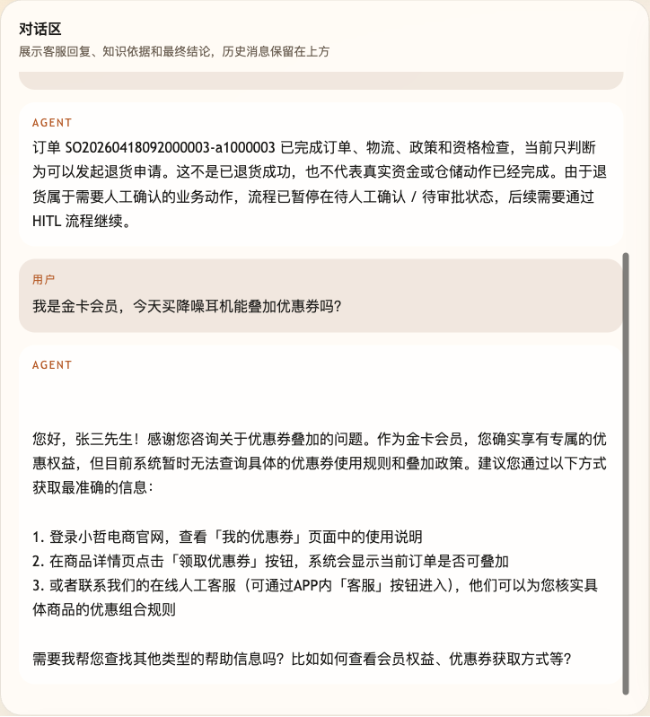

# 第 03 课代码：LLM 客服边界｜第一版 AI 客服

这一版代码让 `/chat` 后端第一次用“小哲电商客服 Agent”的身份回答真实业务问题。它能把会员活动、订单物流、退款条件这类问题交给大模型生成自然语言回答，但它还没有任何可验证的小哲电商业务事实来源。

它不是可上线客服：

- 不读取活动规则。
- 不查询订单或物流。
- 不判断退款、退货或补偿资格。
- 不创建售后请求。
- 不返回结构化意图、引用来源、工具调用或工作流状态。
- 不包含调试后台页面代码；调试后台仍然是独立共享工具，只通过 Agent 地址调用当前服务。

## 和调试后台的关系

课程里的每个 `agent-course-versions/lesson-xx-*/backend` 都只是一版 Agent 后端。小哲电商客服 Agent 调试后台是根目录 `frontend/` 下的独立工具，通过目标 Agent 地址调用当前课程版本。

默认情况下，这一课监听：

```text
http://localhost:8000
```

如果调试后台使用默认配置，它会请求 `http://localhost:8000/chat`。如果你把这一课的 Agent 跑到其他端口，就把调试后台的 `VITE_AGENT_BASE_URL` 指向新的地址。

## 核心文件

```text
lesson-03-llm-customer-boundary/
  README.md
  backend/
    agent_capabilities.json
    api/
      routes.py
      schemas.py
    agents/
      customer_service_agent.py
    config/
      settings.py
    models/
      llm_client.py
    main.py
```

## 核心链路

```text
/chat
  -> ChatRequest
  -> Lesson03Agent.chat
  -> build_customer_service_messages
  -> call_chat_model
  -> ChatResponse
```

这一版的关键变化是 `agents/customer_service_agent.py` 里的 `build_customer_service_messages`：它把“客服身份 + 用户业务问题”包装成第一版 AI 客服能接收的 messages。`runtime_*` 仍然记录在 `session_state.runtime_context`，暂时不进入模型输入。`models/llm_client.py` 负责调用真实模型；测试通过注入 HTTP 传输层稳定验证请求形态。

如果先借 ReAct 的 Reason / Action / Observation / Answer 看这一版，它只证明业务问题能生成 Answer。`reasoning_summary` 只是公开执行摘要；这一课还没有真正的 Action，也没有业务系统返回的 Observation。

## 启动后端

```bash
cd agent-course-versions/lesson-03-llm-customer-boundary/backend
python main.py
```

后端默认运行在：

```text
http://localhost:8000
```

## 模块划分

- `api/`：继续维持第 02 课的 `/chat` 契约。
- `agents/`：新增“客服边界”编排，把小哲电商身份、不能编业务事实等边界放进回答链路。
- `models/`：继续封装真实模型调用。
- `config/`：继续统一课程环境变量和能力声明。
- `main.py`：仍然只是启动入口，业务边界不写在入口文件里。

## 模型配置

这一课统一读取：

```text
agent-course-versions/course.env
```

如果要改配置文件位置，可以设置：

```text
AGENT_COURSE_ENV=/path/to/course.env
```

本课目录不放 `requirements.txt`，运行时继续复用运行手册里已经准备好的 Python 环境。

## 验证重点

你可以用调试后台、客服网关或 curl 发送：

```text
我是金卡会员，今天买降噪耳机能叠加优惠券吗？
```

你应该看到：

- 请求仍然打到 `POST http://localhost:8000/chat`。
- 响应体包含 `session_id`、`answer`、`reasoning_summary`、`session_state`。
- `session_state.llm_customer_boundary` 明确显示活动规则、订单物流、退款条件和业务工具都还没有接入。
- 响应体不包含 `intent`、`intent_result`、`citations`、`tool_calls` 等后续版本才会出现的字段。

## 截图对照

发送 `我是金卡会员，今天买降噪耳机能叠加优惠券吗？` 后，聊天区重点看第一版 AI 客服能用自然语言接住问题，但会明确说当前无法查询具体优惠规则，说明本课还没有接入可验证的小哲电商业务事实来源：



curl 示例：

```bash
curl -s http://localhost:8000/chat \
  -H 'Content-Type: application/json' \
  -d '{
    "session_id": "lesson03-boundary-check",
    "runtime_user_id": "U1001",
    "runtime_nickname": "张三",
    "runtime_member_level": "gold",
    "runtime_risk_level": "low",
    "user_message": "我是金卡会员，今天买降噪耳机能叠加优惠券吗？"
  }'
```

## 代码仓说明

本目录只保留运行当前课所需的代码、场景材料和说明。请按课程正文里的场景和代码仓根目录下的 `doc/运行手册.md` 启动当前版本，并用调试后台、curl 或课程给出的业务问题观察响应结构。
