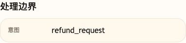

# 第 04 课代码：结构化输出与意图识别

这一版代码只验证一件事：小哲电商客服 Agent 不只返回自然语言 `answer`，还会返回系统可读的第一版 `intent`。

意图识别采用规则优先、小模型兜底：高确定性退款、投诉、物流、优惠等场景先由规则直接分拣；规则不确定时才使用 `AGENT_CLASSIFIER_MODEL` 做结构化分类兜底。

它不是最终 Agent：

- 不读取活动规则或售后政策。
- 不调用订单、物流、库存等业务接口。
- 不做退款、退货或人工审批。
- 不做下一步动作编排或风险分级。
- 不返回 RAG 引用或工具调用。
- 不包含调试后台页面代码；调试后台是独立共享工具。

## 核心文件

```text
lesson-04-intent-structured-output/
  backend/
    api/
      routes.py
      schemas.py
    agents/
      customer_service_agent.py
    config/
      settings.py
    models/
      answer_client.py
      classifier_client.py
    main.py
```

本课新增 `models/classifier_client.py`：规则高置信命中时不调用分类模型；规则不确定时，才把用户消息交给轻量分类模型兜底。`models/answer_client.py` 会在拿到结构化意图后调用真实大模型生成最终客服回复，模型不可用时才回退到本课的克制边界话术。`agents/customer_service_agent.py` 负责“规则优先、模型兜底、结构化意图约束最终回答”的编排。

## 模块划分

- `api/`：返回第一版结构化意图和处理边界。
- `agents/`：负责“规则优先、小模型兜底”的意图识别编排。
- `models/classifier_client.py`：本课新增分类客户端，把自然语言转成稳定 `intent`。
- `models/answer_client.py`：基于 `IntentResult` 调用真实大模型生成 grounded answer。
- `config/`：集中保存模型与能力配置。
- `main.py`：只装配 FastAPI，不直接做分类规则。

## 真实大模型调用

第 04 课不是规则回复 Demo。它有两层模型边界：分类模型只在规则不确定时输出结构化 `intent`，最终回答模型则始终基于 `IntentResult` 和课程边界生成客服回复。

`build_answer()` 现在只是安全回退文本，防止模型配置缺失或服务异常时把售后、退款、投诉说成已经处理完成。正常配置 `AGENT_OPENAI_API_KEY`、`AGENT_OPENAI_BASE_URL` 和 `AGENT_OPENAI_MODEL` 后，`session_state.model_answer.used_model` 会记录最终回答是否来自真实模型。

## 启动后端

```bash
cd agent-course-versions/lesson-04-intent-structured-output/backend
python main.py
```

后端默认运行在：

```text
http://localhost:8000
```

## 验证重点

你可以发送：

```text
我上周买的耳机坏了，想退货退款。
```

你应该能看到：

- 请求打到 `POST http://localhost:8000/chat`。
- 响应体包含 `intent` 和 `intent_result`。
- 退款问题会被标记为 `refund_request`。
- 投诉、赔偿、强烈情绪会被标记为 `complaint`。
- 高置信规则命中时，`intent_result.source` 是 `rules`。
- 响应体不包含 `citations` 或 `tool_calls`。

## 截图对照

发送 `我上周买的耳机坏了，想退货退款。` 后，观察台里重点看 `处理边界` 中的 `意图=refund_request`，说明本课已经把自然语言问题转成系统可读的第一版结构化意图：



curl 示例：

```bash
curl -s http://localhost:8000/chat \
  -H 'Content-Type: application/json' \
  -d '{
    "session_id": "lesson04-intent-check",
    "runtime_user_id": "U1001",
    "runtime_member_level": "gold",
    "runtime_risk_level": "low",
    "user_message": "我上周买的耳机坏了，想退货退款。"
  }'
```
