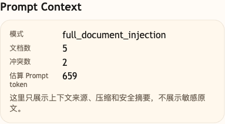

# 第 05 课代码：Prompt 边界与全量规则注入

这一版代码合并原第 05 课和第 06 课的能力推进：先用 system prompt 堵住 AI 客服乱承诺，再把小哲电商活动、售后和客服边界文档全量塞进 Prompt，观察长上下文和新旧规则冲突。

它解决本课的两个连续事故：

- AI 客服代表小哲电商乱承诺退款、赔偿、物流和优惠叠加。
- 老板追问“规则在哪里”后，全量规则注入 Prompt 又让当前活动和历史复盘开始打架。

它不是最终 Agent：

- 不做 RAG、Embedding、向量检索或 citations。
- 不按问题检索相关文档，只做全量 Prompt 注入。
- 不调用订单、物流、库存等业务接口。
- 不做退款、退货、赔偿或人工审批。
- 不做 Trace、Eval 或成本响应字段。
- 不包含调试后台页面代码；调试后台是独立共享工具。

## 核心文件

```text
lesson-05-prompt-boundary/
  backend/
    api/
      routes.py
      schemas.py
    agents/
      customer_service_agent.py
    config/
      settings.py
    models/
      llm_client.py
    prompts/
      loader.py
    main.py
```

## 核心链路

```text
/chat
  -> ChatRequest
  -> classify_intent(user_message)
  -> build_all_policy_context(FULL_POLICY_DOCUMENTS)
  -> detect_context_conflicts(user_message)
  -> build_full_context_messages(...)
  -> call_chat_model(messages)
  -> ChatResponse
```

system prompt 负责客服身份、事实优先级和回答边界。`prompts/loader.py` 故意把规则文档全量拼进 Prompt，`session_state.prompt_context` 记录本轮全量注入了多少文档、估算 Prompt token 数和检测到的冲突线索。

这里的冲突线索只是调试告警，不是完整规则引擎。它能说明当前规则和历史复盘已经同时进入 Prompt，但不会替模型裁决听谁，也不会自动过滤旧文档。Prompt 片段管理会在第 06 课继续推进，多来源上下文的可信度和冲突处理要到第 34 课的 Context Builder 再系统展开。

## 模块划分

- `api/`：沿用聊天入口，并把 Prompt Context 暴露给观察台。
- `agents/`：把用户问题、客服边界和 Prompt Context 组织成一次模型调用。
- `prompts/`：本课新增 Prompt 文档加载层，先展示“整段规则塞进 Prompt”的做法和压力。
- `models/`、`config/`：继续负责模型调用和运行配置。
- `main.py`：只保留启动职责。

## 启动后端

```bash
cd agent-course-versions/lesson-05-prompt-boundary/backend
python main.py
```

后端默认运行在：

```text
http://localhost:8000
```

## 验证重点

你可以发送：

```text
我是金卡，买降噪耳机活动能不能叠加会员券？
```

你应该能看到：

- `/chat` 仍然返回粗意图，例如 `promotion_consult`。
- system prompt 写入客服身份、事实优先级和不得承诺的边界。
- `session_state.prompt_boundary.mode` 是 `system_prompt_fact_priority_and_refusal_rules`。
- `session_state.prompt_context.mode` 是 `full_document_injection`。
- `document_count` 等于本课内置的规则文档数量。
- `conflict_count` 能暴露当前规则和历史规则的冲突线索，但本课不会把它当成自动裁决结果。
- 响应体仍然不包含 `citations`、`tool_calls`、`trace` 或 `cost_summary`。

## 截图对照

发送 `我是金卡，买降噪耳机活动能不能叠加会员券？` 后，观察台里重点看 `Prompt Context`：模式是 `full_document_injection`，同时展示文档数、冲突数和估算 Prompt token，说明本课是在把规则全量塞进 Prompt 后观察上下文压力：



## 代码仓说明

本目录只保留运行当前课所需的代码、场景材料和说明。请按课程正文里的场景和代码仓根目录下的 `doc/运行手册.md` 启动当前版本，并用调试后台、curl 或课程给出的业务问题观察响应结构。
