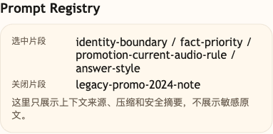

# 第 06 课代码：Prompt 模板与注册表

这一版代码把上一课那面越来越高的 Prompt 墙拆成多个可管理的 Prompt 片段。

它新增：

- `prompt_registry.json`：保存 Prompt 片段。
- `PromptFragment`：用结构化字段描述片段 ID、适用意图、优先级和启用状态。
- `select_prompt_fragments`：按当前粗意图选择需要的片段。
- `render_prompt_template`：按优先级渲染系统 Prompt。

## 核心文件

```text
lesson-06-prompt-registry/
  backend/
    api/
      routes.py
      schemas.py
    agents/
      customer_service_agent.py
    config/
      settings.py
    models/
      llm_client.py
    prompts/
      loader.py
    prompt_registry.json
    main.py
```

它不是最终 Agent：

- 仍然不做 RAG、Embedding、向量检索或 citations。
- 不调用订单、物流、库存等业务接口。
- 不做退款、退货、赔偿或人工审批。
- 不做 Trace、Eval 或成本响应字段。
- Prompt Registry 只是管理规则片段，不等于知识检索。

## 核心链路

```text
/chat
  -> ChatRequest
  -> classify_intent(user_message)
  -> load_prompt_registry()
  -> select_prompt_fragments(intent)
  -> render_prompt_template(...)
  -> call_chat_model(messages)
  -> ChatResponse
```

`prompts/loader.py` 会读取 `prompt_registry.json`，按粗意图选择片段并渲染 messages。`session_state.prompt_registry` 会记录本轮选中了哪些片段、片段优先级和哪些片段被关闭。这样你能看见 Prompt 是怎么被拼出来的，而不是在一整面墙里盲改。

## 模块划分

- `api/`：继续提供 `/chat` 和能力声明。
- `agents/`：根据当前问题选择 Prompt Registry 片段，再调用模型。
- `prompts/loader.py`：读取 `prompt_registry.json`，把 Prompt 从一整面墙拆成可开关片段。
- `models/`、`config/`：保持模型调用和配置职责。
- `main.py`：仍然是薄入口。

## 启动后端

```bash
cd agent-course-versions/lesson-06-prompt-registry/backend
python main.py
```

后端默认运行在：

```text
http://localhost:8000
```

## 验证重点

你可以发送：

```text
降噪耳机会员价还能叠加会员券吗？
```

你应该能看到：

- 当前意图被识别为 `promotion_consult`。
- `selected_fragment_ids` 包含当前音频活动口径。
- 关闭的旧活动复盘片段不会进入本轮 Prompt。
- 响应体仍然不包含 `citations`、`tool_calls` 或 `cost_summary`。

## 截图对照

发送 `降噪耳机会员价还能叠加会员券吗？` 后，观察台里重点看 `Prompt Registry`：它展示本轮选中的 Prompt 片段，以及被关闭的旧活动复盘片段，说明本课不再靠一整面 Prompt 墙盲改：



## 代码仓说明

本目录只保留运行当前课所需的代码、场景材料和说明。请按课程正文里的场景和代码仓根目录下的 `doc/运行手册.md` 启动当前版本，并用调试后台、curl 或课程给出的业务问题观察响应结构。
