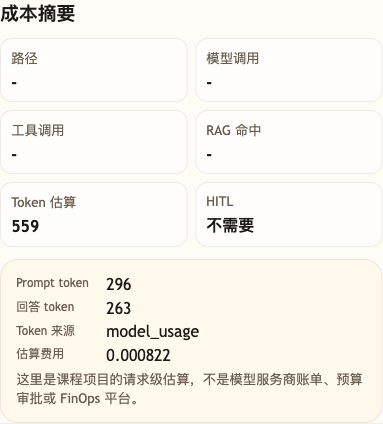

# 第 07 课代码：Token 观察

这一版代码在 Prompt Registry 基础上增加 token 观察。

它新增：

- `TokenUsage`：把模型平台返回的 `usage` 标准化成 Prompt token、回答 token 和总 token。
- `estimate_tokens`：当模型平台没有返回 `usage` 时，用本地估算兜底观察趋势。
- `CostSummary`：记录 Prompt token、回答 token、总 token、token 来源、usage 明细，以及按输入/输出不同单价计算的粗略金额提示。
- `build_cost_summary`：优先使用模型平台 `usage`，没有 `usage` 时才使用本地估算。
- `session_state.cost_log`：记录同一会话里的 token 观察事件数量和最近一次观察结果。

## 核心文件

```text
lesson-07-token-cost-observation/
  backend/
    api/
      routes.py
      schemas.py
    agents/
      customer_service_agent.py
    config/
      settings.py
    cost/
      observer.py
    models/
      llm_client.py
    prompts/
      loader.py
    prompt_registry.json
    main.py
```

这里的 token 来源分两层：真实模型调用优先记录接口返回的 `usage`，也就是模型 tokenizer 计量后的输入/输出 token；如果 OpenAI-compatible 服务没有返回 `usage`，再用 `estimate_tokens` 做本地补充。部分模型还会返回 `reasoning_tokens`、`prompt_cache_hit_tokens` 等明细，本课会放进 `usage_details`。粗略金额提示会区分输入 token 和输出 token，因为很多模型平台两者单价不同；它不替代模型平台真实账单，只帮助你看到：Prompt 已经救过火，但每轮都把规则文字送进模型，账单压力会持续增长。

这版代码的结论很直接：

```text
Prompt Registry 让规则更好维护，但每轮仍然会把规则文字送进模型。
```

token 观察把这个问题摆到台面上，下一课才有理由转向“只找相关资料”。

## 核心链路

```text
/chat
  -> ChatRequest
  -> classify_intent(user_message)
  -> load_prompt_registry()
  -> select_prompt_fragments(intent)
  -> render_prompt_template(...)
  -> call_chat_model(messages)  # 返回 answer 和可选 usage
  -> build_cost_summary(messages, answer, usage)
  -> ChatResponse
```

从这一版开始，`/chat` 顶层响应会出现 `cost_summary`。`cost/observer.py` 专门处理 usage 解析、token 估算和费用趋势，让成本观察成为独立模块，而不是混在客服回答逻辑里。这是这一节新增的当前能力，不是空字段占位。

## 模块划分

- `api/`：把成本摘要放进响应状态，供调试后台观察。
- `agents/`：在 Prompt Registry 回答后追加 token 和费用观察。
- `cost/observer.py`：本课新增成本观察层，负责 usage、估算 token 和估算费用。
- `prompts/`、`models/`、`config/`：继续承接 Prompt 片段、模型调用和运行配置。
- `main.py`：只负责启动当前后端。

## 启动后端

```bash
cd agent-course-versions/lesson-07-token-cost-observation/backend
python main.py
```

后端默认运行在：

```text
http://localhost:8000
```

## 验证重点

你可以发送：

```text
降噪耳机会员价还能叠加会员券吗？
```

你应该能看到：

- 响应体包含 `cost_summary`。
- `prompt_tokens`、`answer_tokens` 和 `total_tokens` 都大于 0。
- `token_source` 会标明本轮来自 `model_usage` 还是 `local_estimate`。
- `usage_details` 会保留模型返回的 reasoning token 和 prompt cache 明细。
- `estimated_input_cost_cny` 和 `estimated_output_cost_cny` 会按输入/输出不同单价分开计算。
- `session_state.cost_log.event_count` 会随同一会话的请求次数增加。
- 响应体仍然不包含 `citations`、`tool_calls`、`trace` 或 `evaluation`。

## 截图对照

发送 `降噪耳机会员价还能叠加会员券吗？` 后，观察台里重点看 `成本摘要`：它展示 Prompt token、回答 token、总 token、token 来源和估算费用，说明本课先把每轮 Prompt 成本摆到台面上：



## 代码仓说明

本目录只保留运行当前课所需的代码、场景材料和说明。请按课程正文里的场景和代码仓根目录下的 `doc/运行手册.md` 启动当前版本，并用调试后台、curl 或课程给出的业务问题观察响应结构。
