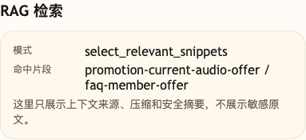

# 第 08 课代码：RAG 思路

这一版代码从“把所有规则塞进 Prompt”转向“先找相关知识，再回答”。

它新增：

- `knowledge/*.md`：小哲电商活动、售后、商品、物流、订单、会员券、支付发票和投诉升级原文。
- `KnowledgeSnippet`：从 Markdown 原文章节读取出来的最小知识块。
- `retrieve_relevant_knowledge`：按用户问题和粗意图找相关知识。
- `session_state.rag`：记录本轮检索模式、候选数量、命中数量和命中的知识 ID。
- 清晰模块边界：`main.py` 只启动应用，RAG、模型调用、成本观察和 Agent 编排拆到独立模块。

这版代码先把最小 RAG 链路立住：

```text
用户问题 -> 找相关知识 -> 只把命中知识放进 Prompt -> 让模型回答
```

这一课的原则是先少而相关，不把所有规则重新塞回 Prompt。

## 核心链路

```text
/chat
  -> ChatRequest
  -> classify_intent(user_message)
  -> load_source_documents()
  -> load_knowledge_snippets()
  -> retrieve_relevant_knowledge(user_message, intent)
  -> render_rag_messages(...)
  -> call_chat_model(messages)
  -> build_cost_summary(messages, answer)
  -> ChatResponse
```

第 08 课继续保留第 07 课已经出现的 `cost_summary`，用来估算相关知识进入 Prompt 后的上下文长度。

## 模块结构

```text
backend/
  main.py                       # FastAPI 应用启动和路由挂载
  api/
    routes.py                   # /health、/capabilities、/chat 路由
    schemas.py                  # 请求、响应、知识片段和成本结构
  agents/
    customer_service_agent.py   # 粗意图 -> RAG -> 模型 -> 成本观察的编排
  rag/
    knowledge_base.py           # Markdown 读取、章节解析、相关知识检索、RAG Prompt
  models/
    llm_client.py               # OpenAI 兼容聊天模型调用
  cost/
    observer.py                 # token 和成本趋势估算
  config/
    settings.py                 # 路径、课程环境变量和能力声明读取
  knowledge/
    *.md                        # 小哲电商知识原文
```

`main.py` 仍然可以直接运行，是为了让每一课都保持 `python main.py` 的启动方式；真正的业务逻辑已经拆进模块里，方便你逐步看到 Agent 从单文件走向生产形态。

## 设计原则

- 先证明 RAG 的位置：回答前先检索相关知识。
- 检索结果宁可少，也不要重新变成全量 Prompt。
- 先用简单关键词和意图加权证明方向，再把文档切片、向量检索和来源展示逐步接上。

## 启动后端

```bash
cd agent-course-versions/lesson-08-rag-thinking/backend
python main.py
```

后端默认运行在：

```text
http://localhost:8000
```

## 验证重点

你可以发送：

```text
金卡会员买降噪耳机，会员价还能叠加优惠券吗？
```

你应该能看到：

- `session_state.rag.mode` 是 `select_relevant_snippets`。
- `matched_snippet_ids` 包含 `promotion-current-audio-offer`。
- Prompt 只带本轮相关知识，不再全量塞入所有规则。
- 旧活动复盘不会因为关键词相似就混进当前 Prompt。

## 截图对照



这张图重点看 `RAG 检索`：本轮模式是 `select_relevant_snippets`，命中片段指向当前降噪耳机活动，说明回答前已经先选出相关知识，而不是把所有规则都塞进 Prompt。

## 代码仓说明

本目录只保留运行当前课所需的代码、场景材料和说明。请按课程正文里的场景和代码仓根目录下的 `doc/运行手册.md` 启动当前版本，并用调试后台、curl 或课程给出的业务问题观察响应结构。
