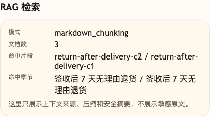

# 第 09 课代码：文档切片与 Metadata

这一版代码把上一课“粗读 Markdown 章节”的做法推进成规范化切片。

它新增：

- `backend/knowledge/*.md`：复用生产形状知识库，包括售后政策、商品知识、物流/发票/FAQ。
- `infer_document_metadata`：根据生产知识文件名补文档级 metadata。
- `infer_section_metadata`：根据生产知识章节标题补业务域、场景 key、风险级别和关键词。
- `parse_sections`：按 Markdown 二级标题拆章节，并把章节 metadata 合入 section。
- `split_into_chunks`：按 `chunk_size` 和 `chunk_overlap` 切片。
- `KnowledgeChunk`：把文本、来源、章节和 metadata 绑在一起；`section_id` 标识稳定章节，`chunk_id` 是最终片段 ID。
- 清晰模块边界：文档读取、metadata 推断、切片和检索进入 `rag/knowledge_base.py`，Agent 只负责复用启动时构建好的 chunks。

这版代码先解决知识入库前的颗粒度问题：

```text
生产 Markdown 原文 -> 推断文档 metadata -> 推断章节 metadata -> chunk -> KnowledgeChunk
```

调试后台、商城和电商后端都是调用方，不放进这一版快照。

## 核心链路

```text
Agent 启动
  -> load_source_documents()
  -> parse_sections(markdown)
  -> split_into_chunks(section_text)

/chat
  -> ChatRequest
  -> retrieve_chunks(user_message, chunks)
  -> render_chunked_rag_messages(...)
  -> call_chat_model(messages)
  -> ChatResponse
```

`session_state.rag` 会记录 `document_count`、`chunk_count`、`chunk_size`、`chunk_overlap`、命中的 chunk ID 和命中的章节，帮助你看到文档怎么变成可检索片段。

## 模块结构

```text
backend/
  main.py                       # FastAPI 应用启动和路由挂载
  api/
    routes.py                   # /health、/capabilities、/chat 路由
    schemas.py                  # SourceDocument、KnowledgeSection、KnowledgeChunk 等结构
  agents/
    customer_service_agent.py   # 启动时构建 chunks，聊天时复用 chunks
  rag/
    knowledge_base.py           # 文档读取、metadata 推断、章节切分、chunk 检索、Prompt 渲染
  models/
    llm_client.py               # OpenAI 兼容聊天模型调用
  cost/
    observer.py                 # token 和成本趋势估算
  config/
    settings.py                 # 路径、chunk 参数、课程环境变量和能力声明读取
  knowledge/
    *.md                        # 生产形状知识文档
```

这一课的 `main.py` 仍然能直接运行，但它已经不是所有逻辑的容器。你可以沿着 `agents/customer_service_agent.py` 看到 Agent 怎么在启动时构建知识片段，再沿着 `rag/knowledge_base.py` 看文档如何一步步变成 chunk。

## 参数原则

`chunk_size` 和 `chunk_overlap` 不是固定答案。

在这版教学知识库里，`chunk_size=160`、`chunk_overlap=32` 只是起点。设置参数时先看三件事：

- 先按 Markdown 标题切出业务章节，再用长度切片兜底。
- `chunk_size` 要尽量让一条完整规则的条件、结论和例外口径能被读懂。
- `chunk_overlap` 只保留切片边缘的一点上下文，避免条件和结论被切断，也避免大量重复内容重新挤进 Prompt。

## 启动后端

```bash
cd agent-course-versions/lesson-09-document-chunking/backend
python main.py
```

后端默认运行在：

```text
http://localhost:8000
```

## 验证重点

你可以发送：

```text
签收七天内，耳机包装配件都在，能无理由退货吗？
```

你应该能看到：

- `session_state.rag.mode` 是 `markdown_chunking`。
- `document_count` 是当前知识文档数量。
- `chunk_count` 是切片后的知识片段数量。
- `matched_sections` 包含 `签收后 7 天无理由退货`。
- 命中的 chunk 能带回原始文档、章节和 metadata。

## 截图对照



这张图重点看 `markdown_chunking`、命中 chunk 和命中章节。它把“Markdown 原文先切成带 metadata 的片段，再用于检索”这条链路落到可观察结果上。

## 代码仓说明

本目录只保留运行当前课所需的代码、场景材料和说明。请按课程正文里的场景和代码仓根目录下的 `doc/运行手册.md` 启动当前版本，并用调试后台、curl 或课程给出的业务问题观察响应结构。
