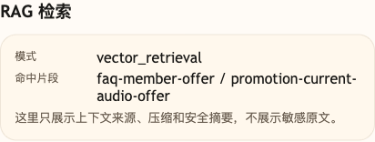

# 第 10 课代码：Embedding 与向量检索

这一版代码让小哲电商 Agent 第一次用“向量相似度”检索知识片段。

它新增：

- `knowledge/*.md`：小哲电商活动、售后、商品、物流、订单、会员券、支付发票和投诉升级原文档。
- `load_source_documents` / `build_knowledge_chunks`：从 Markdown 原文构建可检索 chunk。
- `EmbeddingClient`：调用硅基流动 OpenAI 兼容 `/embeddings` 接口，把文本转成可比较的向量。
- `embed_text`：封装 embedding 调用，让检索链路只关心“输入文本，输出向量”。
- `embed_texts`：把一批知识 chunk 批量交给 embedding 接口，避免真实服务下逐条等待。
- `build_vector_store`：为每个知识 chunk 保存向量。
- `get_vector_store`：进程内懒加载并缓存向量库，避免每次请求都重新向量化整批知识。
- `retrieve_by_vector`：按 cosine similarity、`top_k` 和 `score_threshold` 返回命中片段。
- 清晰模块边界：知识 chunk、embedding 客户端、向量库、RAG Prompt 和 Agent 编排分别在独立模块里。

这版代码专注把检索从关键词命中推进到“语义像不像”：

```text
text -> embedding -> cosine similarity -> threshold -> top_k
```

## embedding 怎么接

这一版直接调用硅基流动的商用 embedding 模型。

统一配置读取：

```env
AGENT_OPENAI_BASE_URL=https://api.siliconflow.cn/v1
AGENT_EMBEDDING_MODEL=Qwen/Qwen3-Embedding-4B
```

核心请求是：

```text
POST https://api.siliconflow.cn/v1/embeddings
model = Qwen/Qwen3-Embedding-4B
input = 用户问题或知识 chunk 文本
```

模型返回 `data[0].embedding` 后，代码继续用 cosine similarity 比较用户问题向量和知识 chunk 向量。

`cosine_similarity` 会先检查两个向量维度是否一致，避免模型升级或缓存混用时被 Python `zip()` 静默截断，算出错误分数。

`EmbeddingClient` 会用 `[base_url, model, text]` 的 SHA-256 作为进程内缓存 key，避免长文本直接作为字典 key。同一服务、同一模型、同一文本可以复用 embedding；服务重启后缓存会丢。课程调试可以加本地文件临时缓存，正式的持久化、版本和失效策略放到后续存储与索引课程处理。

检索前会按 `effective_status` 做候选过滤：普通咨询只检索 `active` 规则；用户明确问历史、复盘、双11或 2024 时，才允许 historical 片段参与向量检索。

向量库在进程内懒加载一次。第一次检索会批量向量化知识 chunk，后续请求只向量化用户问题，再和缓存的知识向量计算相似度。知识版本、索引重建和缓存失效会放到后续索引更新课程里展开。

本课的 `CHUNK_SIZE=420`、`CHUNK_OVERLAP=80` 是为了让一条客服规则尽量保留完整条件、结论和例外口径。第 09 课的 `160 / 32` 更偏向说明切片结构；第 10 课开始做向量召回，需要避免把一条规则切得过碎。这个数字不是 embedding 模型要求，也不是通用标准，换模型或知识库后要重新验证 chunk 是否足够完整且不混杂。

知识 chunk 做 embedding 时会拼接 `title`、`section`、`keywords` 和 `text`。这些短字段给检索提供业务语境，但不能代替正文依据；如果 metadata 太泛或写错，也会干扰召回。

## 核心链路

```text
/chat
  -> ChatRequest
  -> EmbeddingClient.embed(user_message)
  -> load_source_documents()
  -> build_knowledge_chunks()
  -> build_vector_store(chunks)
  -> retrieve_by_vector(query, top_k, score_threshold)
  -> render_vector_rag_messages(...)
  -> call_chat_model(messages)
  -> ChatResponse
```

`session_state.rag` 会记录 `mode=vector_retrieval`、`embedding_model`、`top_k`、`score_threshold`、命中的 chunk ID 和分数。

## 模块结构

```text
backend/
  main.py                       # FastAPI 应用启动和路由挂载
  api/
    routes.py                   # /health、/capabilities、/chat 路由
    schemas.py                  # KnowledgeChunk、VectorRecord、请求和响应结构
  agents/
    customer_service_agent.py   # 粗意图 -> 向量检索 -> 模型 -> 成本观察的编排
  rag/
    knowledge_base.py           # Markdown 读取、章节解析、chunk 构建、候选过滤
    vector_store.py             # 向量库构建、缓存、cosine similarity、top_k 召回
    prompting.py                # 向量检索版 RAG Prompt 渲染
  embeddings/
    client.py                   # OpenAI 兼容 embedding 调用、批量向量化和文本缓存
  models/
    llm_client.py               # OpenAI 兼容聊天模型调用
  cost/
    observer.py                 # token 和成本趋势估算
  config/
    settings.py                 # 路径、embedding 默认值、chunk 参数、阈值和课程环境
  knowledge/
    *.md                        # 小哲电商知识原文
```

这一课的 `main.py` 仍然保留旧入口名，是为了课程测试和直接运行体验稳定；真正的生产式边界已经拆到模块里。你可以先读 `agents/customer_service_agent.py` 看完整链路，再分别进入 `embeddings/client.py` 和 `rag/vector_store.py` 理解向量化与召回。

## 参数原则

这里的 `TOP_K=2`、`SCORE_THRESHOLD=0.28` 是配合本课知识库、当前 embedding 模型和验收样例的教学起点，不是固定答案，也不是跨模型通用标准。

- `score_threshold` 先挡掉明显无关的 chunk，避免弱相关内容硬进 Prompt。
- `score_threshold` 要按模型、知识库和问题集校准。换 embedding 模型后，分数分布可能整体变化，不能直接照搬 `0.28`。
- `top_k` 先小一点，避免向量检索把一堆相似片段重新塞回模型。
- 调参时同时看三件事：应该命中的有没有进来、无关问题有没有被挡住、top_k 里有没有太多“有点像但不能当依据”的片段。

`0.28` 的取法可以按这个逻辑复现：先准备本课要覆盖的正例问题，例如会员价能否叠加优惠券、签收后能否退货、预售多久发货；再准备明显不属于小哲电商知识库的负例问题，例如订机票酒店。把这些问题和知识 chunk 都转成 embedding 后，观察 cosine similarity 的分布。

本课希望阈值落在两类分数之间：

- 正例的目标 chunk 要能留下来，否则 Agent 会明明有知识却说没有依据。
- 负例和明显跑题问题要被挡掉，否则 Agent 会把无关知识硬塞进 Prompt。
- 边界问题即使过线，也要交给 `top_k=2` 和后续低置信课程继续收敛，而不是在第 10 课一次性解决所有 RAG 质量问题。

因此 `0.28` 不是“相似度大于 0.28 就一定可信”的业务承诺，而是本课样本下的最低入场线：低于它的片段先不进入上下文，高于它的片段还要继续按分数排序、截断和后续课程的低置信逻辑处理。

## 启动后端

```bash
cd agent-course-versions/lesson-10-embedding-retrieval/backend
python main.py
```

后端默认运行在：

```text
http://localhost:8000
```

## 验证重点

你可以发送：

```text
金卡会员买降噪耳机，会员价还能叠加优惠券吗？
```

你应该能看到：

- `session_state.rag.mode` 是 `vector_retrieval`。
- `matched_chunk_ids` 包含 `promotion-current-audio-offer`。
- `scores` 里能看到每个命中片段的向量相似度分数。
- 低于阈值的片段不会进入本轮 RAG 上下文。

## 截图对照



这张图重点看 `vector_retrieval` 和命中片段。它对应本课从关键词思路推进到 embedding 相似度检索后的运行状态。

## 代码仓说明

本目录只保留运行当前课所需的代码、场景材料和说明。请按课程正文里的场景和代码仓根目录下的 `doc/运行手册.md` 启动当前版本，并用调试后台、curl 或课程给出的业务问题观察响应结构。
