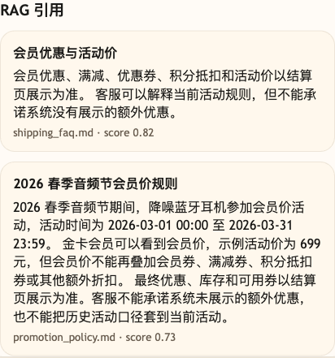

# 第 11 课代码：RAG Citations｜引用来源

这一版代码在第 10 课“向量检索 + 模型回答 + 成本观察”的基础上增加 `citations`。小哲电商客服 Agent 回答知识类问题时，仍然把向量命中片段交给模型生成回答，同时把命中的知识来源作为 `citations` 返回。

这一版沿用第 10 课的 embedding 与向量检索链路。知识来自 `backend/knowledge/*.md` 原文档，代码会从 Markdown 原文解析章节 metadata，构建 chunk，向量召回命中片段，再把命中结果转成 citations。

本课的重点不是重新讲相似度怎么算，而是把：

```text
KnowledgeHit -> RAG messages -> call_chat_model(...)
KnowledgeHit -> Citation -> ChatResponse.citations
messages + answer -> cost_summary
```

这条证据链接清楚。

## 模块结构

```text
backend/
  main.py                       # FastAPI 应用启动和路由挂载
  api/
    routes.py                   # /health、/capabilities、/chat 路由
    schemas.py                  # KnowledgeHit、Citation、ChatResponse 等结构
  agents/
    customer_service_agent.py   # 向量命中 -> 模型回答 -> citations -> 成本摘要
  cost/
    observer.py                 # 沿用第 10 课的请求级成本估算
  models/
    llm_client.py               # 沿用第 10 课的 OpenAI 兼容聊天模型调用
  rag/
    knowledge_base.py           # Markdown 读取、章节解析、chunk 构建、候选过滤
    vector_store.py             # 向量库构建、缓存、cosine similarity、top_k 召回
  embeddings/
    client.py                   # OpenAI 兼容 embedding 调用、批量向量化和文本缓存
  config/
    settings.py                 # 路径、embedding 默认值、chunk 参数、阈值和课程环境
  knowledge/
    *.md                        # 小哲电商知识原文
```

`main.py` 仍然负责启动应用；第 11 课新增的证据链在 `agents/customer_service_agent.py` 里生成，向量召回基础能力继续由 `rag/vector_store.py` 和 `embeddings/client.py` 承担。

## 启动后端

```bash
cd agent-course-versions/lesson-11-rag-citations/backend
python main.py
```

后端默认运行在：

```text
http://localhost:8000
```

## 验证重点

你可以发送：

```text
金卡会员今天买降噪耳机，有什么优惠？
```

你应该能看到：

- 请求打到 `POST http://localhost:8000/chat`。
- 响应体包含 `citations`。
- 响应体继续包含 `cost_summary`。
- `session_state.rag.mode` 是 `vector_retrieval`。
- 每条 citation 都有 `source_title`、`source_path`、`chunk_id`、`score`、`snippet`。
- 响应体不包含 `tool_calls`。
- 没有知识命中的问题会明确说没有可靠依据。

## 截图对照



这张图重点看 `RAG 引用`：每条引用带回来源文件、依据片段和 score，证明回答不只是“像是对的”，还能追到知识来源。

curl 示例：

```bash
curl -s http://localhost:8000/chat \
  -H 'Content-Type: application/json' \
  -d '{
    "session_id": "lesson11-citation-check",
    "runtime_user_id": "U1001",
    "runtime_member_level": "gold",
    "runtime_risk_level": "low",
    "user_message": "金卡会员今天买降噪耳机，有什么优惠？"
  }'
```

## 代码仓说明

本目录只保留运行当前课所需的代码、场景材料和说明。请按课程正文里的场景和代码仓根目录下的 `doc/运行手册.md` 启动当前版本，并用调试后台、curl 或课程给出的业务问题观察响应结构。
