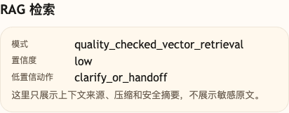
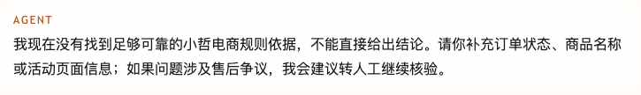

# 第 12 课代码：RAG 质量评测与低置信兜底

这一版代码沿用第 11 课已经出现的模型回答、`citations` 和 `cost_summary`，再补两件事：

- 用固定问题集检查基础 RAG 召回质量。
- 对低置信检索结果做兜底，不让 Agent 硬编规则结论。

它新增：

- `knowledge/*.md`：当前 RAG 使用的小哲电商知识原文。
- `load_source_documents` / `build_knowledge_chunks`：从 Markdown 原文构建可检索 chunk。
- `EmbeddingClient`：沿用硅基流动 OpenAI 兼容 `/embeddings` 接口生成问题和 chunk 的向量。
- `embed_texts`：批量生成知识 chunk 向量，避免真实服务下逐条等待。
- `rag_quality_cases.json`：本课固定问题集。
- `run_rag_quality_check`：计算每个 case 的 `recall_at_k`、`precision_at_k` 和通过状态。
- `LOW_CONFIDENCE_THRESHOLD`：低置信判断阈值。
- `session_state.rag_quality`：保存本课轻量质量检查摘要。

这版代码先把基础 RAG 的质量底线立住：

```text
固定问题集检查质量，低置信命中不包装成依据。
```

## 核心链路

```text
/chat
  -> load_source_documents()
  -> build_knowledge_chunks()
  -> EmbeddingClient.embed(user_message)
  -> retrieve_knowledge(user_message)
  -> is_low_confidence(hits)
  -> call_chat_model(...)  # 仅高置信命中
  -> build_citations(reliable_hits)
  -> build_fallback_answer()  # 低置信兜底
  -> run_rag_quality_check()
  -> ChatResponse(answer, citations, cost_summary, session_state.rag)
```

低置信时，`reliable_hits` 会变成空列表，`citations` 也会是空列表。Agent 会请用户补充信息或建议转人工，而不是拿弱命中硬答。

embedding 配置仍然统一读取 `agent-course-versions/course.env`：

```env
AGENT_OPENAI_BASE_URL=https://api.siliconflow.cn/v1
AGENT_EMBEDDING_MODEL=Qwen/Qwen3-Embedding-4B
```

## 模块结构

```text
backend/
  main.py                       # FastAPI 应用启动和路由挂载
  api/
    routes.py                   # /health、/capabilities、/chat 路由
    schemas.py                  # Citation、RagQualityCase、RagQualitySummary 等结构
  agents/
    customer_service_agent.py   # 检索 -> 低置信判断 -> 模型回答/citations/兜底回答
  cost/
    observer.py                 # 沿用请求级成本估算
  models/
    llm_client.py               # 高置信命中时生成自然语言回答
  rag/
    knowledge_base.py           # Markdown 读取、章节解析、chunk 构建
    retrieval.py                # 向量召回、chunk embedding 文本、候选入场阈值
    quality.py                  # 固定问题集、recall/precision、低置信判断
  embeddings/
    client.py                   # OpenAI 兼容 embedding 调用、批量向量化和文本缓存
  config/
    settings.py                 # 路径、embedding 默认值、chunk 参数、质量阈值和课程环境
  knowledge/
    *.md                        # 小哲电商知识原文
  rag_quality_cases.json        # 本课固定问题集
```

`main.py` 只保留启动和路由挂载。你可以从 `agents/customer_service_agent.py` 看一轮请求怎么决定“回答还是兜底”，再进入 `rag/quality.py` 看固定问题集如何度量召回质量。

## 设计原则

固定问题集先覆盖四类问题：

- 高频问题：用户经常问，必须稳定命中。
- 高风险问题：答错容易造成售后争议。
- 易混淆问题：相似规则、相似活动或细条件容易找偏。
- 知识库外问题：没有小哲电商依据时必须兜底。

`LOW_CONFIDENCE_THRESHOLD=0.68` 是基础兜底线。调阈值时要同时看两种错误：该答的问题有没有被误兜底，不该答的问题有没有被硬编成规则结论。

这个数来自本课固定问题集的最高分分布，而不是通用公式。课程测试向量下，`promotion-current-offer` 的最高分约 `0.818`，`after-sale-day-eight` 的最高分约 `0.805`，知识库外的 `unknown-travel-booking` 没有可靠候选；同时售后问题会召回一个弱相关备选片段，分数约 `0.596`。所以本课把二次门槛放在 `0.68`：低于正例最低最高分，给正例留缓冲；高于弱相关分数，避免弱命中被包装成 citation。

这里的 `0.68` 不是第 10 课那种候选 chunk 入场阈值，而是看 `hits[0].score` 的二次门槛：最高分命中低于它时，即使检索到弱相关片段，也不把片段包装成可靠 citation。它来自本课固定问题集的分数分布：活动和售后正例要高于这条线，知识库外问题要兜底，边界问题要继续观察。换 embedding 模型、知识文件或 chunk 粒度后，需要重新跑固定问题集校准。

## 启动后端

```bash
cd agent-course-versions/lesson-12-rag-quality-fallback/backend
python main.py
```

后端默认运行在：

```text
http://localhost:8000
```

## 验证重点

你可以发送：

```text
小哲电商能帮我订机票和酒店吗？
```

你应该能看到：

- `citations` 是空列表。
- `answer` 明确说明没有找到足够可靠依据。
- `session_state.rag.confidence_level` 是 `low`。
- `session_state.rag.low_confidence_action` 是 `clarify_or_handoff`。
- `session_state.rag_quality` 保存固定问题集的召回率和精确率摘要。

## 截图对照



这张图重点看 `confidence_level=low` 和 `low_confidence_action=clarify_or_handoff`，说明弱相关命中不会被包装成可靠依据。



这张图看用户侧回答：没有足够可靠的小哲电商规则依据时，Agent 会要求补充信息或建议转人工，而不是硬编结论。

## 代码仓说明

本目录只保留运行当前课所需的代码、场景材料和说明。请按课程正文里的场景和代码仓根目录下的 `doc/运行手册.md` 启动当前版本，并用调试后台、curl 或课程给出的业务问题观察响应结构。
