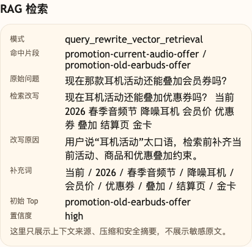

# 第 13 课代码：查询改写

这一版代码沿用第 12 课的 RAG citations 和低置信兜底，再新增一层查询改写。

用户原话仍然原样保留，系统只为检索生成 `rewritten_query`。这样用户说“那个耳机活动”时，检索问题会补齐“当前、2026 春季音频节、降噪耳机、会员价、优惠券、叠加、结算页”等关键词，减少旧活动或商品介绍抢到第一名的概率。

## 核心链路

```text
/chat
  -> classify_intent(user_message)
  -> retrieve_knowledge(original_query)
  -> rewrite_retrieval_query(ChatRequest, intent)
  -> retrieve_knowledge(rewritten_query)
  -> build_citations(reliable_hits)
  -> render_rag_messages(...)
  -> call_chat_model(messages)
  -> ChatResponse
```

## 模块结构

```text
backend/
  main.py                       # FastAPI 应用启动和路由挂载
  api/
    routes.py                   # /health、/capabilities、/chat 路由
    schemas.py                  # QueryRewrite、KnowledgeHit、Citation 等结构
  agents/
    customer_service_agent.py   # 原始检索 -> 查询改写 -> 改写后检索 -> 回答
  rag/
    knowledge_base.py           # knowledge_chunks.json 读取
    query_rewrite.py            # 口语归一化、补词、改写原因
    retrieval.py                # 向量召回、top_k、低置信判断
    prompting.py                # citations 和 RAG Prompt 渲染
  embeddings/
    client.py                   # OpenAI 兼容 embedding 调用、批量向量化和文本缓存
  models/
    llm_client.py               # OpenAI 兼容聊天模型调用
  config/
    settings.py                 # 路径、阈值、归一化规则和课程环境
  knowledge_chunks.json         # 本课检索知识片段
```

`main.py` 仍然能直接启动后端；你真正要看的新增能力在 `rag/query_rewrite.py`。它只改检索问题，不改用户原话。

## 当前边界

- 只做查询改写，不做 reranker。
- 只做向量检索式候选排序，不做 Hybrid RAG。
- 不接订单、物流、库存、退款进度等实时业务工具。
- 不做工作流、Memory、Trace、HITL 或完整 Eval 平台。
- `/capabilities` 只给调试后台适配使用，`/chat` 不把能力声明塞进 `session_state`。

## 启动后端

```bash
cd agent-course-versions/lesson-13-query-rewrite/backend
python main.py
```

## 截图对照



这张图重点看 `原始问题`、`检索改写`、`补充词` 和 `初始 Top`。用户口语化提到“那款耳机活动”时，系统为检索补齐当前活动和会员价约束，避免旧活动抢到第一名。

## 代码仓说明

本目录只保留运行当前课所需的代码、场景材料和说明。请按课程正文里的场景和代码仓根目录下的 `doc/运行手册.md` 启动当前版本，并用调试后台、curl 或课程给出的业务问题观察响应结构。
