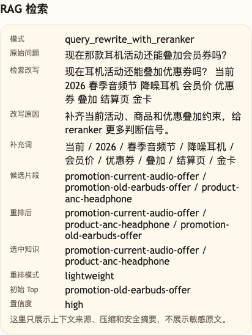

# 第 14 课代码：Reranker 重排

这一版代码沿用第 13 课的查询改写，但不再把初步召回的第一名直接当作最终依据。它先保留一个候选池，再用轻量 reranker 按当前规则、过期状态、优惠叠加条件和结算页约束重新排序。

## 核心链路

```text
/chat
  -> classify_intent(user_message)
  -> rewrite_retrieval_query(...)
  -> retrieve_candidates(original_query)
  -> retrieve_candidates(rewritten_query)
  -> merge_candidates(...)
  -> rerank_candidates(rewritten_query, candidates)
  -> build_citations(selected_hits)
  -> call_chat_model(messages)
  -> ChatResponse
```

## 模块结构

```text
backend/
  main.py                       # FastAPI 应用启动和路由挂载
  api/
    routes.py                   # /health、/capabilities、/chat 路由
    schemas.py                  # RerankConfig、RerankOutcome、带重排分数的 KnowledgeHit
  agents/
    customer_service_agent.py   # 候选召回 -> reranker 重排 -> citations/回答
  rag/
    knowledge_base.py           # knowledge_chunks.json 读取
    query_rewrite.py            # 沿用第 13 课的检索改写
    retrieval.py                # 原始/改写查询的向量候选召回与合并
    reranker.py                 # 轻量重排、商业 reranker 配置、失败兜底
    prompting.py                # 带 rerank_reasons 的 RAG Prompt
  embeddings/
    client.py                   # OpenAI 兼容 embedding 调用、批量向量化和文本缓存
  models/
    llm_client.py               # OpenAI 兼容聊天模型调用
  config/
    settings.py                 # 路径、候选数、重排模型默认值、阈值和课程环境
  knowledge_chunks.json         # 本课检索知识片段
```

第 14 课新增能力集中在 `rag/reranker.py`：召回仍然只负责把候选找出来，reranker 才负责重新排序。

## 当前边界

- 默认用轻量 reranker 展示排序逻辑，配置商业 reranker 后可调用完整排序模型服务。
- 只重排已有候选，不解决向量初召回漏召回问题。
- 不接订单、物流、库存、退款进度等实时业务工具。
- 不做工作流、Memory、Trace、HITL 或完整 Eval 平台。
- `/capabilities` 只服务调试后台适配，正课主流程仍然是 `/chat`。

## 启动后端

```bash
cd agent-course-versions/lesson-14-reranker/backend
python main.py
```

## 截图对照



这张图重点看 `候选片段`、`重排后`、`选中知识` 和 `初始 Top`。它说明本课不是直接相信初步召回第一名，而是先保留候选池，再把更符合当前活动规则的知识排到前面。

## 代码仓说明

本目录只保留运行当前课所需的代码、场景材料和说明。请按课程正文里的场景和代码仓根目录下的 `doc/运行手册.md` 启动当前版本，并用调试后台、curl 或课程给出的业务问题观察响应结构。
