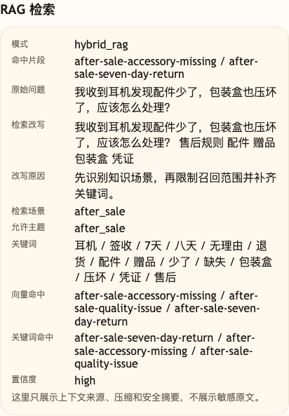

# 第 15 课代码：Hybrid RAG

这一版代码把 RAG 检索拆成两层：`pre_retrieval_plan` 先判断知识场景并限制召回范围，`retrieve_knowledge` 再组合向量召回和关键词召回。它解决的是长尾售后词、规则关键词和相似场景混在一起时，单靠向量相似度不够稳的问题。

本课的 `vector_retrieve` 已经使用 OpenAI 兼容 embedding 和 cosine similarity；`keyword_retrieve` 保留轻量 BM25 直觉实现，用来抓“赠品”“包装盒”“压坏”这类边界词。

## 核心链路

```text
/chat
  -> classify_intent(user_message)
  -> pre_retrieval_plan(ChatRequest, intent)
  -> vector_retrieve(plan)
  -> keyword_retrieve(plan)
  -> merge_hybrid_hits(plan, vector_hits, keyword_hits)
  -> build_citations(reliable_hits)
  -> generate_stable_rag_answer(messages)
  -> ChatResponse
```

## 模块结构

```text
backend/
  main.py                       # FastAPI 应用启动，显式导出课程测试用符号
  api/
    routes.py                   # /health、/capabilities、/chat 路由
    schemas.py                  # RetrievalPlan、KnowledgeHit、Citation 等结构
  agents/
    customer_service_agent.py   # pre-retrieval -> Hybrid RAG -> citations/回答
  embeddings/
    client.py                   # OpenAI 兼容 embedding 客户端和文本向量缓存
  rag/
    knowledge_base.py           # knowledge_chunks.json 读取
    planning.py                 # 场景识别、allowed_topics、keyword_terms
    hybrid_retrieval.py         # vector_retrieve、keyword_retrieve、merge_hybrid_hits
    prompting.py                # Hybrid RAG Prompt 和 citations
  models/
    llm_client.py               # 稳定知识 RAG 回答模型适配器
  config/
    settings.py                 # 路径、top_k、embedding 默认配置、低置信阈值和课程环境
  knowledge_chunks.json         # 本课检索知识片段
```

第 15 课新增能力主要在 `rag/planning.py` 和 `rag/hybrid_retrieval.py`：先决定“去哪类知识里找”，再把向量召回和关键词召回合并。

## 当前边界

- 为了聚焦 Hybrid RAG，`intent` 先沿用轻量规则分类；第 04 课的小模型兜底分类和后续 RoutePlan 机制不在本课展开。这里的 `scene` 是检索场景，不是完整业务决策。
- Hybrid RAG 只处理稳定知识检索，不查实时订单、物流、库存或退款进度。
- 关键词召回只是轻量 BM25 直觉实现，不是完整搜索引擎；生产环境通常交给 Elasticsearch、OpenSearch 或专门 lexical retriever。
- 不做 RAG Fusion、多知识库或权限过滤，它们只是后续增强方向。
- 不做工作流、Memory、Trace、HITL 或完整 Eval 平台。
- `/capabilities` 只服务调试后台适配。

## 启动后端

```bash
cd agent-course-versions/lesson-15-hybrid-rag/backend
python main.py
```

## 截图对照



这张图重点看 `检索场景`、`允许主题`、`向量命中` 和 `关键词命中`。长尾售后词出现时，系统先限制知识场景，再把向量召回和关键词召回合并，避免单一路径漏掉关键规则。

建议按调试后台的三张场景卡片依次观察：

1. “每天坐地铁上下班，想少受车厢噪声影响，哪款产品比较合适？”没有直接使用“降噪”“ANC”“耳机”等知识库关键词，重点观察向量路能否按语义召回 `product-anc-headphone`。
2. “收到货发现包装被压坏了，要先保留哪些材料？”使用知识库已有的“压坏”边界词，重点观察关键词路只召回 `after-sale-accessory-missing`，而向量路仍会保留多个语义候选。
3. “ANC 耳机的金卡会员价还能叠加优惠券吗？”同时包含商品语义和活动规则词，重点观察 `promotion-current-audio-offer` 的向量、关键词双路来源，以及历史活动被过滤后的结果。

这三张卡片不是三套互斥的检索开关。本课每轮都会执行向量召回和关键词召回；“向量主导”“关键词补漏”和“双路融合”描述的是本轮最终能观察到的证据贡献差异。

## 代码仓说明

本目录只保留运行当前课所需的代码、场景材料和说明。请按课程正文里的场景和代码仓根目录下的 `doc/运行手册.md` 启动当前版本，并用调试后台、curl 或课程给出的业务问题观察响应结构。
