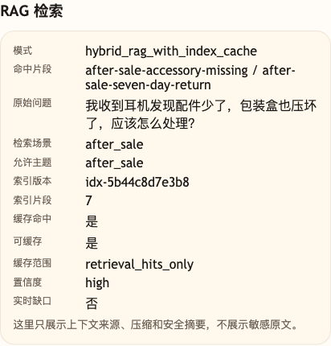

# 第 16 课代码：索引更新与 RAG 缓存

这一版代码沿用第 15 课的 Hybrid RAG，再新增本地知识索引和 RAG 检索缓存。

索引会根据知识 chunk 生成 `index.version` 和倒排表。重建索引时会清空检索缓存，避免旧规则继续被复用。RAG 缓存只保存稳定知识的检索结果，不缓存最终回答，也不缓存订单、物流、库存、退款进度这类实时业务问题。

调试后台默认问题“电子发票通常多久能准备好？”不会在规则路由里写死为某个意图。它先进入开放主题的语义检索，命中已发布的 `invoice-electronic-normal`，再由知识状态、检索置信度和实时性共同判断能否缓存：第一次执行检索，第二次相同请求命中检索缓存。它不是某张发票的实时开具状态查询。

## 核心链路

```text
/chat
  -> get_knowledge_index()
  -> classify_intent(user_message)
  -> pre_retrieval_plan(ChatRequest, intent)
  -> retrieve_knowledge(plan, index)
       -> 实时事实直接短路，不执行知识检索
       -> 已有缓存：用缓存命中证据重新校验 cache_policy_for(plan, hits)，失败则按未命中处理
       -> 未命中：Hybrid RAG -> cache_policy_for(plan, hits) -> 按策略写缓存
  -> build_citations(reliable_hits)
  -> generate_stable_rag_answer(messages)
  -> ChatResponse
```

## 模块结构

```text
backend/
  main.py                       # FastAPI 应用启动，显式导出课程测试用符号
  api/
    routes.py                   # /health、/capabilities、/chat 路由
    schemas.py                  # KnowledgeIndex、RetrievalCacheEntry、RetrievalPlan 等结构
  agents/
    customer_service_agent.py   # 索引确认 -> Hybrid RAG -> 缓存边界 -> 回答
  embeddings/
    client.py                   # 沿用第 15 课的 embedding 客户端和文本向量缓存
  rag/
    knowledge_base.py           # knowledge_chunks.json 读取
    planning.py                 # 场景识别、实时业务问题识别、检索计划
    index_cache.py              # 索引构建、版本、重建、检索缓存策略
    hybrid_retrieval.py         # 基于 KnowledgeIndex 的 Hybrid RAG 和缓存读写
    prompting.py                # 带索引版本的 RAG Prompt 和 citations
  models/
    llm_client.py               # OpenAI 兼容聊天模型调用，用于稳定知识 RAG 回答
  config/
    settings.py                 # 路径、top_k、embedding 默认配置、低置信阈值和课程环境
  knowledge_chunks.json         # 本课检索知识片段
```

第 16 课沿用第 15 课的真实 embedding 向量召回和关键词召回；新增能力集中在 `rag/index_cache.py`：它管理索引版本和检索缓存失效，确保缓存依赖的是同一版知识。

缓存 key 由 `index_version`、`scene`、归一化后的 `rewritten_query`、`allowed_topics` 和 `keyword_terms` 共同生成；key 相同也不代表一定能写缓存，写入前还会校验实时性、最高分阈值和全部命中知识状态。`rebuild_knowledge_index` 会生成新索引版本并清空检索缓存，让旧版本结果失效。

## 当前边界

- 为了聚焦索引更新与 RAG 缓存，`intent` 先沿用轻量规则分类；第 04 课的小模型兜底分类和后续 RoutePlan 机制不在本课展开。这里的 `scene` 是检索场景，不是完整业务决策。
- 只做索引重建、倒排表和检索缓存，不实现真实 ANN 服务。
- 缓存只覆盖稳定知识检索结果，不缓存最终自然语言回答。
- 实时订单、物流、库存和退款进度不走 RAG 缓存，必须等第五幕接入实时业务事实或业务工具。
- RAG Fusion、多知识库、权限过滤只作为后续增强方向，不在本课展开实现。
- 不做工作流、Memory、Trace、HITL 或完整 Eval 平台。

## 启动后端

```bash
cd agent-course-versions/lesson-16-index-cache/backend
python main.py
```

上面的路径以云效代码小仓根目录为起点；如果你使用包含 `code/` 目录的完整课程发布包，请先进入 `code/` 再执行同样的路径。

## 截图对照



这张图来自同一个稳定知识问题的第二次请求，重点看 `索引版本`、`缓存命中=是`、`可缓存=是` 和 `缓存范围=retrieval_hits_only`。它说明缓存只保存检索结果，不缓存最终自然语言回答，也不会替代实时订单或物流查询。

## 代码仓说明

本目录只保留运行当前课所需的代码、场景材料和说明。请按课程正文里的场景和代码仓根目录下的 `doc/运行手册.md` 启动当前版本，并用调试后台、curl 或课程给出的业务问题观察响应结构。
