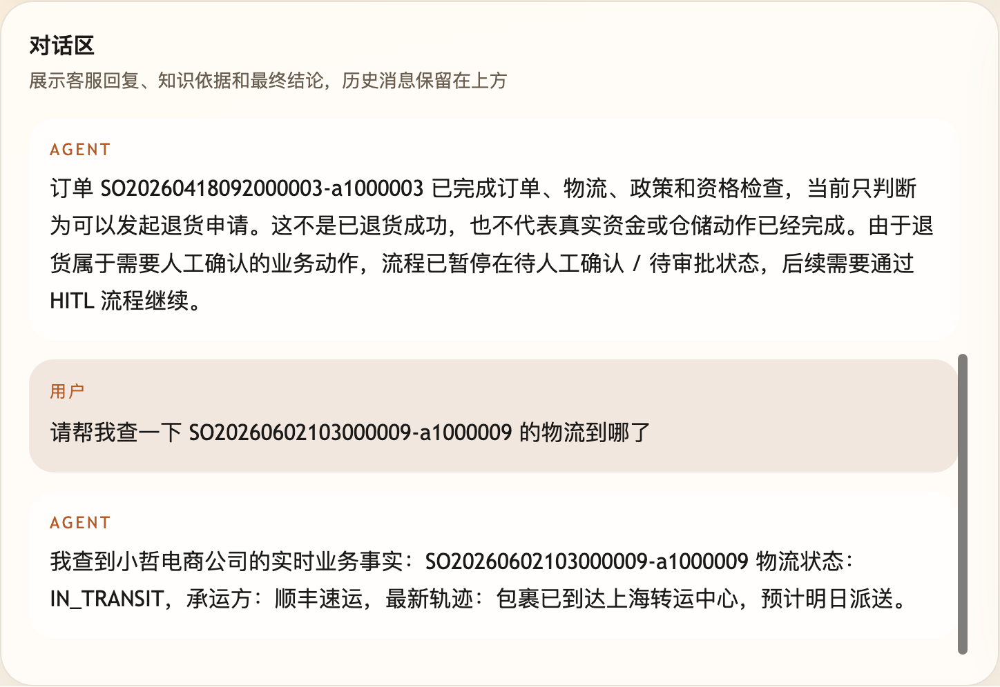
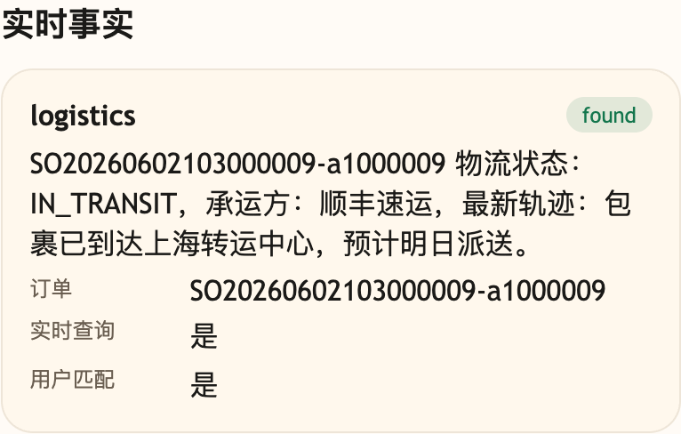

# 第 17 课代码：实时事实与业务接口

这一版代码沿用第 16 课的 Hybrid RAG 和索引缓存，但把订单、物流和商品库存这类实时事实从 RAG 知识库里拆出来。

代码里不再维护订单、物流、商品库存的本地假数据。订单候选优先使用电商后端按当前用户校验后传入的 `runtime_context.currentUserOrders`，具体订单、物流和商品事实则通过电商后端只读接口查询。

## 模块划分

- `main.py`：只负责创建 FastAPI 应用和挂载路由，保持入口文件轻量。
- `api/schemas.py` 与 `api/routes.py`：集中放请求/响应模型和 HTTP 路由，让接口契约先从入口文件里拆出来。
- `config/settings.py`：读取 capabilities 和课程环境变量。
- `models/llm_client.py`、`models/answer_client.py`、`rag/`、`knowledge_chunks.json`：保留第 16 课已经完成的稳定知识 RAG、索引和缓存能力，并让实时事实路径也由真实模型基于事实组织回答。
- `integrations/ecommerce_client.py`：封装小哲电商后端只读接口，实时事实不再散落在 Agent 编排里。
- `tools/runtime_context.py` 与 `tools/planning.py`：整理当前用户上下文，并识别这一轮是不是需要实时业务事实。
- `services/business_facts.py`：第 17 课新增的事实接入层，负责按当前用户身份查询订单、物流和商品事实。第 18 课会把这类受控事实查询进一步包装成 LangChain Tool。
- `agents/customer_service_agent.py`：只编排本课链路，不直接堆业务接口细节。

第 17 课不是把第 16 课能力推倒重来。稳定规则问题继续走 `rag/` 和 `models/llm_client.py`；只有订单、物流、库存、退款进度这类实时事实，才从 RAG 分流到 `BusinessFactService`。

## 核心链路

```text
/chat
  -> classify_intent(user_message)
  -> detect_business_fact_need(ChatRequest)
  -> 实时事实：BusinessFactService.lookup(need, ChatRequest)
  -> 可信实时事实：compose_grounded_answer(facts)
  -> 稳定知识：Hybrid RAG + index cache -> generate_stable_rag_answer()
  -> ChatResponse
```

## 真实大模型调用

第 17 课保留第 16 课的 RAG 模型回答，同时把订单、物流、库存这类实时事实路径也接回大模型。业务接口先按当前用户身份取回可信事实，`models/answer_client.py` 再把这些事实交给真实模型生成最终回复。

如果事实不存在、订单不属于当前用户、或模型配置不可用，系统才回退到确定性安全话术。你可以在响应的 `session_state.model_answer` 里看到本轮是否真正使用了模型。

## 当前边界

- 只接入订单、物流和商品库存的只读事实查询。
- 稳定知识问答继续保留第 16 课的 RAG citations、索引版本和检索缓存。
- 事实查询直接通过 `BusinessFactService` 调用真实电商事实来源，重点是建立事实接入层和身份边界。
- 响应只返回业务事实状态，不返回工具执行链路或高风险审批字段。
- 不做 LangGraph、HITL、Hooks、MCP、Memory、Trace 或完整 Eval 平台。

## 启动后端

```bash
cd agent-course-versions/lesson-17-realtime-business-facts/backend
python main.py
```

## 截图对照

发送 `请帮我查一下 SO20260602103000009-a1000009 的物流到哪了` 后，聊天区重点看回答不再编物流，而是使用电商后端查到的实时状态：



观察台里重点看 `实时事实` 卡片：订单号、实时查询、用户匹配和物流状态都来自业务接口：



## 代码仓说明

本目录只保留运行当前课所需的代码、场景材料和说明。请按课程正文里的场景和代码仓根目录下的 `doc/运行手册.md` 启动当前版本，并用调试后台、curl 或课程给出的业务问题观察响应结构。
