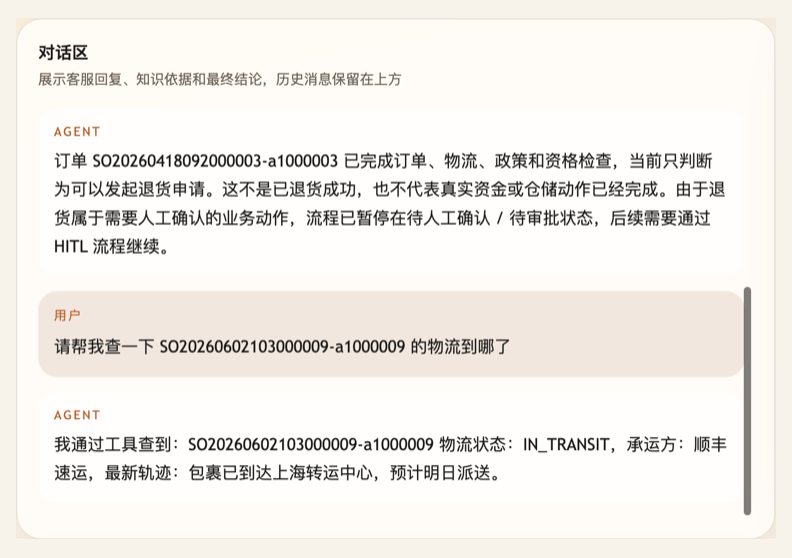
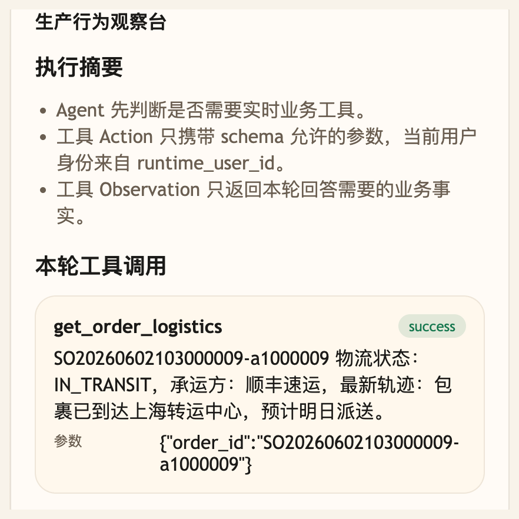

# 第 18 课代码：Tool Calling

这一版把第 17 课的真实业务事实服务包装成 LangChain 工具箱，让 Agent 用 `create_agent` 生成明确的 Action / Observation，查询订单物流、商品库存和退款进度。第 16/17 课已经完成的稳定知识 RAG 仍然保留：活动规则、售后规则这类非实时问题继续走 Hybrid RAG 和 citations。

## 模块划分

- `main.py`：保持薄入口，只启动应用。
- `api/`、`config/`、`integrations/`、`tools/runtime_context.py`：沿用第 17 课的接口、配置、外部系统接入和当前用户上下文分层。
- `tools/contracts.py`：本课新增工具契约，集中声明工具名、描述、必填参数和参数 schema。
- `tools/planning.py`：保留轻量意图识别，用于缺参数时提前提示和响应标注；工具选择交给 LangChain + 真实 ChatModel。
- `tools/langchain_tools.py`：把课程工具契约包装成 LangChain `StructuredTool`，并把执行重新收口到后端校验层。
- `tools/tool_runtime.py`：执行只读工具，并用 `runtime_user_id` 校验订单归属。
- `models/llm_client.py`：读取 `course.env`，创建真实 OpenAI-compatible ChatModel。
- `rag/`、`knowledge_chunks.json`：沿用前序稳定知识 RAG；Tool Calling 只接管实时事实查询，不替代知识检索。
- `agents/customer_service_agent.py`：用 LangChain `create_agent` 编排工具调用闭环，并把 LangChain 消息整理成课程响应。

## 核心链路

```text
/chat
  -> classify_intent(user_message)
  -> stable knowledge? Hybrid RAG + citations
  -> realtime fact? create_agent(model, StructuredTool[])
  -> LangChain AIMessage(tool_calls)
  -> StructuredTool -> validate_tool_action(action)
  -> execute_tool_action(action, ChatRequest)
  -> LangChain ToolMessage(observation)
  -> ChatResponse(citations or tool_calls)
```

## 当前边界

- 只做只读工具查询和稳定知识 RAG，不做退款、取消订单、补偿等写操作。
- `runtime_user_id` 是当前工具调用的可信身份边界，不展开完整 Runtime Context 体系。
- LangChain 负责工具调用循环，工具执行层读取电商后端传入的当前用户真实订单上下文，并在需要时调用电商后端只读事实接口；本课不维护硬编码订单或商品事实表。
- 缺参数时只提示需要订单号，还没有结构化澄清。
- 不做 ToolResult 压缩、降级、Hooks、MCP、Memory、Trace、HITL 或完整 Eval 平台；这些关闭项不影响已保留的稳定知识 RAG。

## 启动后端

```bash
cd agent-course-versions/lesson-18-tool-calling/backend
python main.py
```

## 截图对照

发送 `请帮我查一下 SO20260602103000009-a1000009 的物流到哪了` 后，聊天区重点看 Agent 明确说明“通过工具查到”物流事实：



观察台里重点看 `get_order_logistics` 的 `success`、工具参数和 Observation 摘要，确认模型只提出结构化工具调用，实际执行由后端完成：



## 代码仓说明

本目录只保留运行当前课所需的代码、场景材料和说明。请按课程正文里的场景和代码仓根目录下的 `doc/运行手册.md` 启动当前版本，并用调试后台、curl 或课程给出的业务问题观察响应结构。
