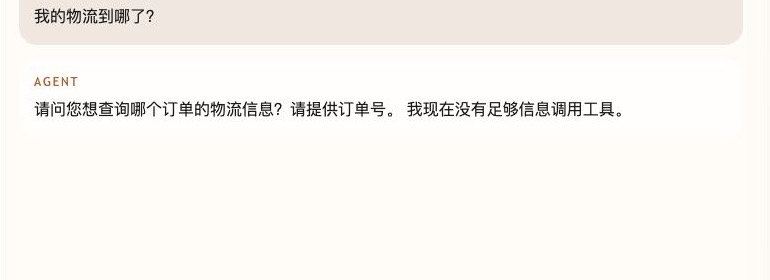
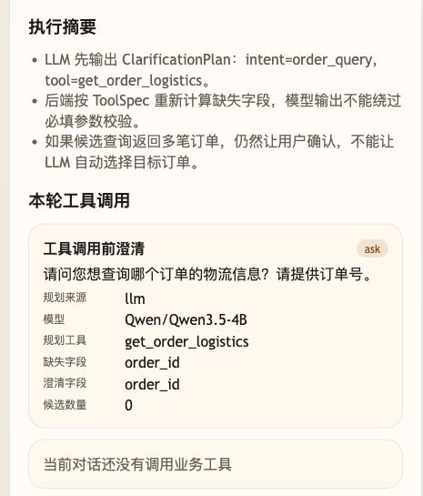

# 第 19 课代码：澄清机制

这一版增加 LLM 参与的工具澄清。Agent 先区分稳定知识和实时工具请求：活动规则这类稳定知识继续走 Hybrid RAG；订单、退款进度、库存这类实时事实才让模型输出 `ClarificationPlan`，判断用户意图、候选工具、已知参数和缺失字段。后端再按 `ToolSpec`、当前登录用户和电商后端传入的真实订单上下文做硬校验。

第 18 课已经把实时事实查询接入 LangChain Tool Calling。本课为了把“缺参数先澄清、候选结果不能让模型代选”讲清楚，暂时把工具循环拆成 `ClarificationPlan -> 后端校验 -> Tool Action` 三段观察；这属于机制拆解，不代表后续生产形态放弃 LangChain。

## 模块划分

- `main.py`：仍然只是启动层和路由挂载。
- `api/`、`config/`、`integrations/`、`tools/contracts.py`、`tools/runtime_context.py`：沿用前两课形成的基础分层。
- `models/clarification_planner.py`：本课新增 LLM 澄清规划客户端，只产出 `ClarificationPlan` 草案。
- `models/answer_client.py`：在工具结果可用时，基于 `ClarificationPlan`、Tool Action 和 Observation 调用真实模型生成最终回复。
- `rag/`、`knowledge_chunks.json`：沿用稳定知识 RAG，避免工具澄清课程段丢掉前序知识问答能力。
- `tools/planning.py`：校验模型草案、补运行时上下文、计算缺失字段，并生成澄清请求或工具 Action。
- `tools/tool_runtime.py`：继续只执行后端允许的只读工具，不让模型直接碰业务系统。
- `agents/customer_service_agent.py`：编排“模型规划 -> 后端校验 -> 工具前/工具后澄清”的完整链路。

## 核心链路

```text
/chat
  -> stable knowledge? Hybrid RAG + citations
  -> realtime fact? ClarificationPlannerModelClient.plan_clarification()
  -> ClarificationPlan(intent, tool_name, known_arguments, missing_required)
  -> pre_tool_clarification(ChatRequest, ClarificationPlan)
  -> plan_tool_action(ClarificationPlan)
  -> execute_tool_action(action, ChatRequest)
  -> post_tool_clarification(action, observation)
  -> compose_grounded_answer(plan, action, observation)
  -> ChatResponse(clarification, tool_calls)
```

## 真实大模型调用

第 19 课有两处模型参与：先由 LLM 生成 `ClarificationPlan`，再由真实模型基于后端校验后的计划、工具动作和 Observation 生成最终回复。

需要用户补充订单号或确认候选订单时，最终回答不会让模型自由发挥，而是保留确定性澄清问题；工具结果可用时才把 Observation 交给模型组织自然语言。模型不可用时，`build_answer()` 的安全话术作为降级结果返回。

## 当前边界

- 处理工具调用前的缺参数澄清，也处理候选查询后的工具后澄清。
- LLM 只负责规划澄清草案；后端会重新计算必填字段，过滤模型输出的 `user_id` 等越界参数。
- 订单候选来自 `runtime_context.currentUserOrders`，该上下文由电商后端按当前登录用户校验后传入；本课不再维护硬编码订单表。
- 模型不可用时不会回退到旧规则路径，本轮不生成 Tool Action，也不调用业务工具；稳定知识 RAG 不依赖这个澄清模型。
- 工具前澄清态不调用工具；工具后澄清会保留本轮候选查询 `tool_calls`。
- 不做 ToolResult 压缩、`next_action`、错误降级、Hooks、MCP、Memory、Trace、HITL 或完整 Eval 平台。

## 启动后端

```bash
cd agent-course-versions/lesson-19-tool-clarification/backend
python main.py
```

## 截图对照

发送 `我的物流到哪了？` 后，聊天区重点看 Agent 不直接猜订单，而是先反问订单号：



观察台里重点看 `ClarificationPlan`、规划工具 `get_order_logistics`、缺失字段 `order_id`，以及当前还没有真正调用业务工具：



## 代码仓说明

本目录只保留运行当前课所需的代码、场景材料和说明。请按课程正文里的场景和代码仓根目录下的 `doc/运行手册.md` 启动当前版本，并用调试后台、curl 或课程给出的业务问题观察响应结构。
