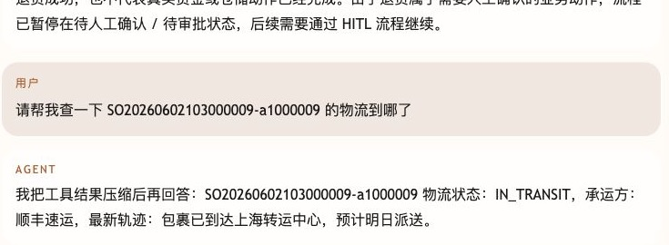
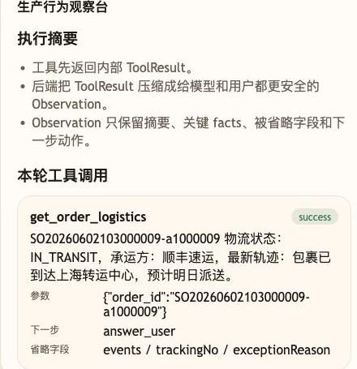

# 第 20 课代码：ToolResult 与 Observation

这一版从小哲电商后端和页面运行时上下文读取订单、物流、商品事实，再把工具内部返回的 `ToolResult` 压缩成 `Observation`，避免把原始 payload、完整物流轨迹、促销描述和其他不该进入回答上下文的字段直接塞回模型。稳定知识问题仍走 Hybrid RAG 和 citations，不伪装成工具 Observation。

这里继续是 Tool Calling 生产链路里的机制拆解课：第 18 课已经演示 LangChain 负责提出 tool call，本课专门展开 tool call 执行后，业务原始结果怎样被压缩成可进入模型上下文的 Observation。后续综合版本应把这层 Observation 治理接回 LangChain 工具执行层。

## 模块划分

- `main.py`：薄入口，负责挂路由，不承载工具细节。
- `api/`、`config/`、`integrations/`、`tools/runtime_context.py`、`tools/planning.py`：延续前面工具和上下文分层。
- `tools/tool_runtime.py`：本课明确区分内部 `ToolResult` 和工具执行过程。
- `observability/observation.py`：本课新增 Observation 压缩层，只保留摘要、关键 facts、`omitted_fields` 和 `next_action`。
- `models/answer_client.py`：只把压缩后的安全 Observation 交给真实模型生成最终回答。
- `rag/`、`knowledge_chunks.json`：沿用稳定知识 RAG；Observation 只治理实时工具结果。
- `agents/customer_service_agent.py`：把澄清、工具执行、Observation 压缩和最终回答串起来。

## 核心链路

```text
/chat
  -> stable knowledge? Hybrid RAG + citations
  -> realtime fact? pre_tool_clarification(ChatRequest, intent)
  -> plan_tool_action(ChatRequest, intent)
  -> execute_tool_action(action, ChatRequest)
  -> build_observation(tool_result)
  -> compose_grounded_answer(observation)
  -> ChatResponse(tool_calls, next_action)
```

## 真实大模型调用

第 20 课的重点不是用模板读 Observation，而是控制什么内容可以进入模型上下文。工具返回完整 `ToolResult` 后，后端先压缩成安全 `Observation`，再由 `models/answer_client.py` 调用真实模型生成最终回复。

缺参数澄清、没有 Observation、模型配置缺失或模型服务异常时，系统才回退到确定性安全话术。响应里的 `session_state.model_answer` 会记录 `used_model` 和回退原因。

## 当前边界

- 只做工具结果压缩、`next_action` 和稳定知识 RAG 保留。
- 工具事实来自真实电商后端接口和运行时上下文，不再维护本地订单、物流、商品模拟表。
- Observation 保留摘要、关键 facts 和 omitted_fields，不暴露原始工具 payload 或当前用户完整订单列表。
- 不做错误分类、重试、降级、Hooks、MCP、Memory、Trace、HITL 或完整 Eval 平台。

## 启动后端

```bash
cd agent-course-versions/lesson-20-tool-result-observation/backend
python main.py
```

## 截图对照

发送 `请帮我查一下 SO20260602103000009-a1000009 的物流到哪了` 后，回答只使用压缩后的 Observation 摘要：



观察台里重点看 `get_order_logistics` 的 `success`、`下一步 answer_user`，以及被省略的 `events / trackingNo / exceptionReason`：



后台工具调用拿到的原始物流返回里，仍然带着完整轨迹和运单号。README 这里保留一段摘录，方便和上面的 Observation 对比：

```json
{
  "company": "顺丰速运",
  "trackingNo": "SF202606020009CN",
  "status": "IN_TRANSIT",
  "estimatedDelivery": "2026-06-08",
  "latestUpdate": "包裹已到达上海转运中心，预计明日派送",
  "events": [
    {
      "occurredAt": "2026-06-02T15:00:00",
      "content": "小哲电商已发货"
    }
  ]
}
```

也就是说，后台工具返回可以保留业务排查所需的细节；进入模型回答上下文前，Observation 只保留摘要、关键 facts、`omitted_fields` 和 `next_action`。

## 代码仓说明

本目录只保留运行当前课所需的代码、场景材料和说明。请按课程正文里的场景和代码仓根目录下的 `doc/运行手册.md` 启动当前版本，并用调试后台、curl 或课程给出的业务问题观察响应结构。
