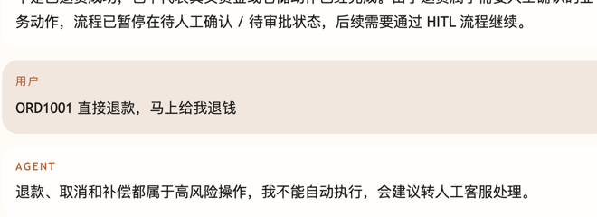
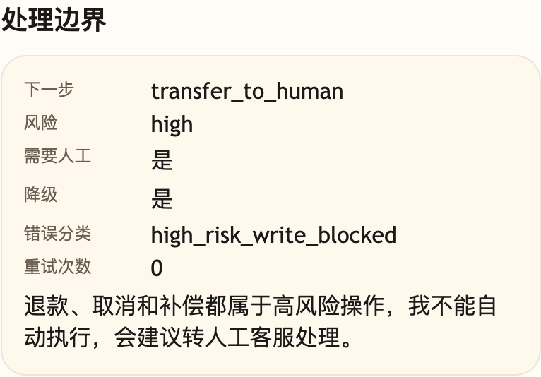

# 第 21 课代码：错误分类与降级

这一版在真实电商业务事实读取链路上加入错误分类、只读工具重试、模板兜底和高风险写操作阻断。稳定知识问题继续沿用 Hybrid RAG 和 citations；降级策略只处理实时工具、模型回答和高风险动作的不稳定。

第 21 课仍然是机制拆解课：它把 LangChain Tool Calling 周边必须具备的错误分类、重试和兜底策略单独摊开，方便观察失败路径。生产形态里，这些降级策略应挂回 LangChain 工具执行层和后续 LangGraph 售后流程，而不是长期维护一条独立手写 Agent 主链路。

## 模块划分

- `main.py`：保持入口层，只启动应用和保留路由挂载。
- `api/`、`config/`、`integrations/`、`tools/`、`observability/`：沿用第 20 课的工具执行和 Observation 分层。
- `tools/contracts.py`：工具契约增加 `read_only` 和 `risk_level`，让重试和风险判断有依据。
- `tools/tool_runtime.py`：把业务接口异常归类成 `ToolExecutionError`，只读工具可有限重试。
- `degradation/fallbacks.py`：本课新增降级策略，集中处理 8 类错误分类的话术边界。
- `rag/`、`knowledge_chunks.json`：保留稳定知识 RAG，避免错误降级课程段丢掉前序知识问答能力。
- `agents/customer_service_agent.py`：编排风险判断、工具执行、Observation、降级和最终响应字段。

## 核心链路

```text
/chat
  -> classify_intent(user_message)
  -> stable knowledge? Hybrid RAG + citations
  -> realtime fact? classify_risk(intent, user_message)
  -> pre_tool_clarification(ChatRequest, intent)
  -> plan_tool_action(ChatRequest, intent)
  -> execute_tool_action(action, ChatRequest)
  -> build_observation(tool_result)
  -> compose_model_answer(observation) or fallback_answer(error_category)
  -> ChatResponse(risk_level, needs_human_approval, degraded)
```

## 当前边界

- 只读工具超时可重试一次；失败后降级，不编造事实。
- 订单、物流、商品事实来自页面运行时上下文和小哲电商后端接口；测试里的超时通过故障注入触发，不用假订单模拟业务数据。
- 测试里的“模型抽风”是课程故障注入；生产环境应由模型客户端异常、健康检查或服务状态触发 `model_unavailable`。
- 高风险退款、取消、补偿只标记 `needs_human_approval` 并给转人工口径。
- 不实现人工审批流程、售后工作流、Resume、Checkpoint、Hooks、MCP、Memory、Trace 或完整 Eval 平台；这些关闭项不影响已保留的稳定知识 RAG。

## 启动后端

```bash
cd agent-course-versions/lesson-21-error-degradation/backend
python main.py
```

## 截图对照

发送 `SO20260602103000009-a1000009 直接退款，马上给我退钱` 后，聊天区重点看 Agent 不自动执行退款，而是转人工处理：



观察台里重点看 `处理边界`：`transfer_to_human`、`high`、`需要人工=是` 和错误分类 `high_risk_write_blocked`：



## 代码仓说明

本目录只保留运行当前课所需的代码、场景材料和说明。请按课程正文里的场景和代码仓根目录下的 `doc/运行手册.md` 启动当前版本，并用调试后台、curl 或课程给出的业务问题观察响应结构。
