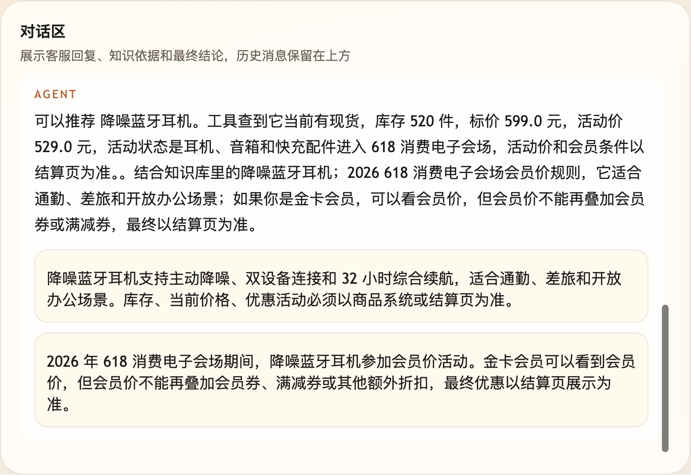
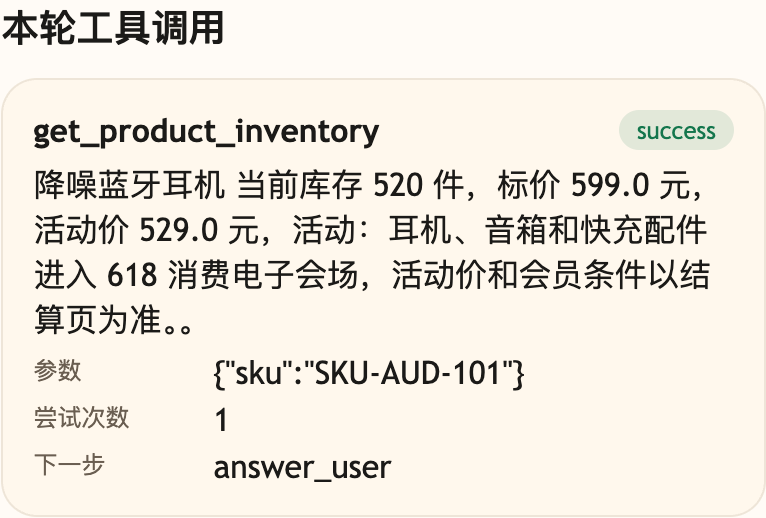

# 第 22 课代码：Tool + RAG 商品咨询

这一版把小哲电商后端的商品库存价格工具和商品知识 RAG 合在一起回答商品咨询。

## 模块划分

- `main.py`：薄入口，继续只负责 FastAPI 启动和路由挂载。
- `api/`、`config/`、`integrations/`、`tools/`：沿用前面形成的接口、配置、业务后端和工具分层。
- `tools/planning.py`：识别商品咨询和高风险退款边界，低风险商品问题才进入商品工具。
- `tools/tool_runtime.py`：执行 `get_product_inventory`，把实时库存、价格、活动状态整理为 Observation。
- `rag/product_knowledge.py`：本课新增商品知识检索和 citation 构造。
- `models/answer_client.py`：把已经确认过的 Tool Observation 与 RAG citations 交给模型生成有来源边界的最终话术；模型不可用时回到规则兜底。
- `agents/customer_service_agent.py`：把工具 Observation 与 RAG citations 合成一个有来源边界的回答。

## 核心链路

```text
/chat
  -> classify_intent(user_message)
  -> plan_tool_action(ChatRequest, intent)
  -> execute_product_tool(action)
  -> retrieve_product_knowledge(user_message, sku)
  -> build_citations(hits)
  -> compose_grounded_answer(observation, citations)
  -> ChatResponse(tool_calls, citations)
```

## 当前边界

- 商品咨询同时看实时库存价格和稳定知识。
- 库存、标价、活动价来自 `/api/products`，不是课程快照里的本地商品表。
- 高风险退款、取消和补偿只保留边界提示，不进入售后审批。
- 不做 LangGraph、HITL、Resume、Checkpoint、Hooks、MCP、Memory、Trace 或完整 Eval 平台。

## 启动后端

```bash
cd agent-course-versions/lesson-22-tool-rag-product-answer/backend
python main.py
```

## 截图对照

发送 `我通勤想买降噪耳机，现在有库存吗，活动怎么算？` 后，聊天区重点看回答同时包含实时库存价格和知识库引用依据：



观察台里重点看 `get_product_inventory` 的工具结果：库存、价格、活动状态来自业务工具，商品卖点和活动规则来自 RAG：



## 代码仓说明

本目录只保留运行当前课所需的代码、场景材料和说明。请按课程正文里的场景和代码仓根目录下的 `doc/运行手册.md` 启动当前版本，并用调试后台、curl 或课程给出的业务问题观察响应结构。

## 真实大模型调用

本课默认会把已经确认过的 Tool、RAG、Workflow 或上下文事实交给真实 OpenAI 兼容模型生成最终客服话术，并在 `session_state.model_answer` 里记录 `used_model`、`model_name` 和降级原因。规则化回答只作为模型不可用、输出为空、测试隔离或安全边界触发时的降级兜底；它不是本课主路径。
