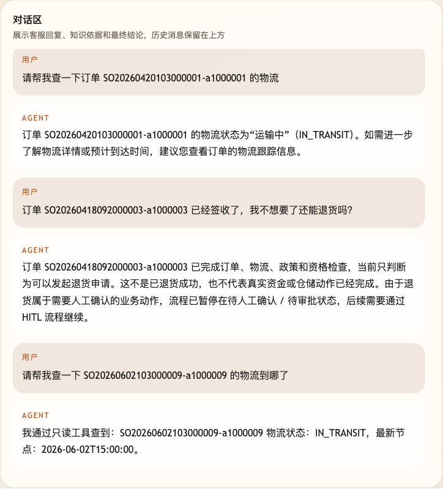
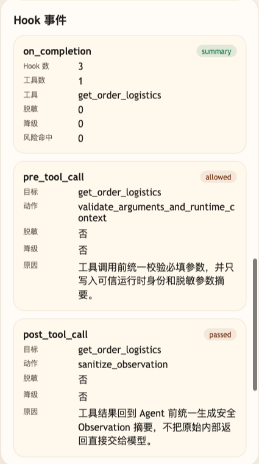

# 第 23 课代码：Hooks 治理

这一版把真实电商工具调用前校验、工具调用后安全摘要、错误降级和本轮完成摘要收拢到统一 Hooks 治理点。

## 模块划分

- `main.py`：薄入口，只负责 FastAPI 启动和路由挂载。
- `api/`、`config/`、`integrations/`、`tools/`：沿用前面已经形成的接口、配置、业务后端和工具分层。
- `hooks/manager.py`：本课新增 Hooks 生命周期卡口，集中处理调用前校验、调用后摘要、异常降级和完成摘要。
- `observability/observation.py`：把工具返回压缩成安全 Observation，避免把原始业务响应直接交给模型。
- `models/answer_client.py`：根据干净 Observation 组织模型回答；模型不可用时抛出明确错误，交给降级层处理。
- `degradation/fallbacks.py`：把超时、模型不可用等异常统一转换成可解释的降级响应。
- `agents/customer_service_agent.py`：把工具执行、Hooks 事件和最终回答串成一轮客服 Agent 流程。

## 核心链路

```text
/chat
  -> classify_intent(user_message)
  -> classify_risk(intent, user_message)
  -> pre_tool_clarification(ChatRequest, intent)
  -> plan_tool_action(ChatRequest, intent)
  -> HookManager.pre_tool_call(action, request, spec)
  -> execute_tool_action(action, ChatRequest)
  -> build_observation(tool_result)
  -> HookManager.post_tool_call(observation)
  -> HookManager.on_error(...) when needed
  -> HookManager.on_completion(...)
  -> ChatResponse(hook_events, hook_completion)
```

## 当前边界

- `pre_tool_call` 统一校验工具必填参数、运行时身份和脱敏摘要。
- `post_tool_call` 统一生成安全 Observation 摘要，不把原始工具返回直接交给模型。
- `on_error` 统一把超时、模型不可用等异常转成降级信号。
- `on_completion` 只输出公开治理摘要，不输出隐藏推理链。
- 订单、物流、商品事实来自小哲电商后端和运行时上下文；测试里的超时通过故障注入触发，不使用假订单表。
- Hooks 不是 HITL 审批，不批准退款、取消订单或补偿。
- 不做 MCP、LangGraph、HITL、Resume、Checkpoint、Memory、完整 Trace 或完整 Eval 平台。

## 启动后端

```bash
cd agent-course-versions/lesson-23-hooks-governance/backend
python main.py
```

## 截图对照

发送 `请帮我查一下 SO20260602103000009-a1000009 的物流到哪了` 后，聊天区重点看回答仍然是面向用户的物流结论，没有把工具细节、原始返回或内部治理过程暴露出来：



观察台里重点看 `pre_tool_call` 和 `post_tool_call`：前者统一校验必填参数和 Runtime Context，后者把工具结果压成安全 Observation，再交给 Agent 组织回答：



## 代码仓说明

本目录只保留运行当前课所需的代码、场景材料和说明。请按课程正文里的场景和代码仓根目录下的 `doc/运行手册.md` 启动当前版本，并用调试后台、curl 或课程给出的业务问题观察响应结构。

## 真实大模型调用

本课默认会把已经确认过的 Tool、RAG、Workflow 或上下文事实交给真实 OpenAI 兼容模型生成最终客服话术，并在 `session_state.model_answer` 里记录 `used_model`、`model_name` 和降级原因。规则化回答只作为模型不可用、输出为空、测试隔离或安全边界触发时的降级兜底；它不是本课主路径。
