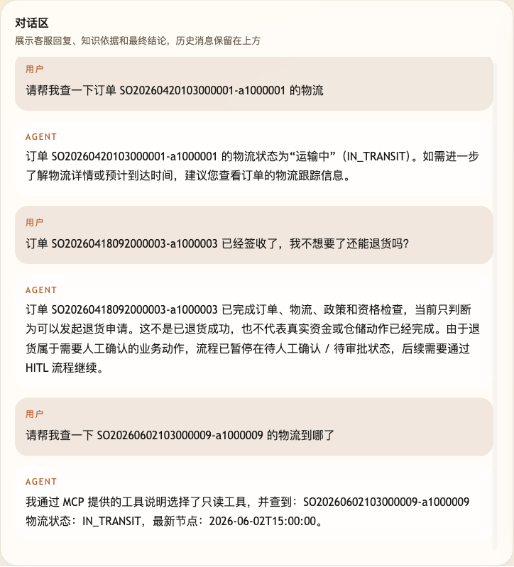
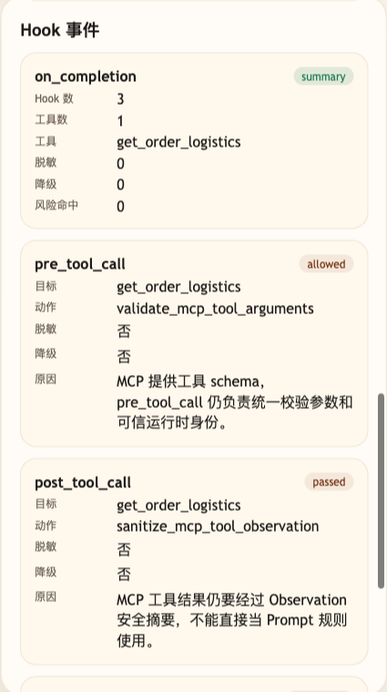

# 第 24 课代码：MCP 与 Tool Use

第 24 课只以本目录里的独立课程快照作为观察路径。

本目录里的 `backend/` 是独立课程快照，可以按第 02-41 课的常规方式启动，用来观察 MCP-style Tool Use、资源 / Prompt 绑定、工具候选和 Hooks 摘要。

课程正文以本目录的独立快照作为主验证路径：你先在快照里看清 MCP-style 工具目录、资源 / Prompt 绑定和 Tool Use 的分工。

这里的 MCP-style 目录用于课程观察，不等于完整远程 MCP Server，也不替代权限、部署、审计和高风险流程。

## 模块划分

- `main.py`：薄入口，继续负责 FastAPI 启动和路由挂载。
- `api/`、`config/`、`integrations/`、`tools/`、`hooks/`、`observability/`、`degradation/`：沿用第 23 课拆出的接口、工具、Hooks、Observation 和降级分层。
- `mcp_catalog/catalog.py`：本课新增 MCP-style 工具目录，统一描述工具名称、参数 schema、资源和 Prompt 绑定；使用 `mcp_catalog` 命名是为了避免和外部 `mcp` 包混淆。
- `models/answer_client.py`：根据 MCP 工具返回后的安全 Observation 组织回答；MCP 只改变工具来源，不替代模型回答层。
- `agents/customer_service_agent.py`：在原有 Tool Use + Hooks 链路上读取 MCP-style 工具说明，再组织用户可见回答。

## 核心链路

```text
/chat
  -> MCPCatalog.to_tool_specs()
  -> MCP-style 工具定义携带 name、description、schema、Resource、Prompt
  -> Tool Use / Planner 根据问题和风险收窄候选工具
  -> execute_tool_action(...) 读取小哲电商业务事实
  -> ToolResult -> Observation
  -> Hooks 调用前校验、调用后摘要、异常降级和完成摘要
  -> ChatResponse(mcp_context, tool_calls, hook_events)
```

## 观察字段

```text
session_state.mcp.tool_source = mcp_catalog
session_state.mcp.selected_tool
session_state.mcp.resources
session_state.mcp.prompts
session_state.mcp.boundary
```

## 当前边界

- MCP-style 目录提供标准化工具说明、Resource 和 Prompt 绑定。
- Runtime Context 仍来自本轮请求，不让模型填写当前用户、会员等级或风险等级。
- Tool Use 仍负责选择工具、填参数、执行工具和组织 Observation。
- Hooks 仍负责调用前校验、调用后安全摘要、异常降级和完成摘要。
- MCP-style 目录不维护订单、物流、商品假数据；业务事实来自小哲电商业务后端和可信 Runtime Context。
- MCP 不是替代 RAG、Workflow、HITL、Memory、Trace 或 Eval 的方案。
- 高风险退款、取消订单和补偿不能因为走 MCP 就绕过 Workflow / HITL / `/chat/resume`。

## 启动独立快照

```bash
cd agent-course-versions/lesson-24-mcp-tool-use/backend
python main.py
```

## 截图对照

发送 `请帮我查一下 SO20260602103000009-a1000009 的物流到哪了` 后，聊天区重点看 Agent 明确通过 MCP 提供的工具说明选择只读物流工具，但用户看到的仍然是业务结论：



观察台里重点看 Hook 动作名：`validate_mcp_tool_arguments` 和 `sanitize_mcp_tool_observation` 说明 MCP 只提供工具入口与 schema，参数校验、可信身份和 Observation 安全摘要仍由 Tool Use / Hooks 链路治理：



## 代码仓说明

本目录保留第 24 课独立快照、截图和说明。学习本课时按本目录启动即可观察 MCP-style Tool Use 的结构：工具能力来自统一目录，执行、Observation 和 Hooks 仍在课程快照自己的链路里完成。

## 真实大模型调用

本课默认会把已经确认过的 Tool、RAG、Workflow 或上下文事实交给真实 OpenAI 兼容模型生成最终客服话术，并在 `session_state.model_answer` 里记录 `used_model`、`model_name` 和降级原因。规则化回答只作为模型不可用、输出为空、测试隔离或安全边界触发时的降级兜底；它不是本课主路径。
