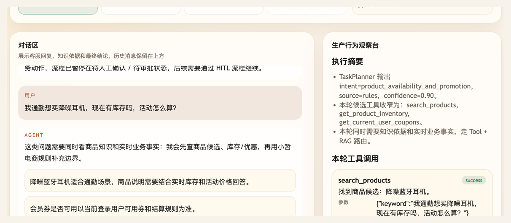

# 第 25 课代码：TaskPlanner 与 RoutePlan

这一版在 Tool、RAG、Hooks 和 MCP 之后加入 TaskPlanner。它先生成 `RoutePlan`，判断本轮要走 RAG、Tool、Tool + RAG，还是把高风险售后请求分流给后续受控路径；轻路径执行读取小哲电商后端和页面运行时上下文里的真实业务事实。

## 模块划分

- `main.py`：薄入口，保留 FastAPI 启动和路由挂载。
- `api/`、`config/`、`integrations/`、`tools/`、`observability/`：沿用前面形成的接口、配置、业务后端、工具执行和 Observation 分层。
- `planner/task_planner.py`：本课新增入口规划器，把用户一句话转换成可校验的 `RoutePlan`。
- `models/task_planner_client.py`：封装低置信场景的轻量分类模型调用，避免把模型请求散落在执行器里。
- `tools/catalog.py`：维护可进入轻路径的工具候选，并按 `RoutePlan.required_tools` 做白名单收窄。
- `rag/knowledge.py`：承接本课 Tool + RAG 路由里的知识引用，和实时工具事实分开管理。
- `agents/customer_service_agent.py`：按 `RoutePlan` 决定进入 RAG、Tool、Tool + RAG，还是高风险分流。

## 核心链路

```text
/chat
  -> TaskPlanner.plan(user_message, runtime_context)
  -> TaskPlanner.plan_by_rules(...)
  -> ToolCatalog.candidate_summaries(route_plan)
  -> constrain_required_tools(route_plan, tool_candidates)
  -> clarification_policy.evaluate(route_plan, extracted_slots)
  -> execute_allowed_light_path(ChatRequest, route_plan)
  -> ChatResponse(route_plan, planner_trace, tool_calls, citations)
```

## Task 生命周期

```text
用户消息
  -> runtime_context
  -> 初始 RoutePlan
  -> ToolCatalog 候选工具
  -> required_tools 白名单收窄
  -> 澄清层检查缺参
  -> 执行器进入 RAG / Tool / Tool + RAG / 高风险分流
  -> 返回 answer + route_plan + planner_trace + 证据字段
```

## 生产模型调用

- 生产版 TaskPlanner 在规则置信度低于 0.85 时，才调用轻量分类模型补充 RoutePlan 候选。
- 分类模型的提示词要求只输出 JSON 字段，包括 `intent`、`needs_rag`、`needs_business_tools`、`required_tools`、`knowledge_domains`、`risk_level`、`requires_workflow` 和 `fallback_policy`。
- Prompt 会带入 `tool_candidates`，但模型输出后仍要经过 ToolCatalog 白名单约束。
- 本课快照读取 `agent-course-versions/course.env`，使用 `AGENT_CLASSIFIER_MODEL` 真实调用 OpenAI-compatible 分类模型。
- 没有有效模型配置时，不伪造 `classifier` 结果；低置信分支会落回 `rules_fallback`，按保守 RoutePlan 收口。

## 当前边界

- TaskPlanner 只做入口路由和候选工具收窄，不生成长执行计划。
- `RoutePlan.requires_workflow = true` 只是高风险分流信号，不表示已经执行 workflow。
- 订单、物流、商品候选、库存和价格来自真实电商后端与运行时上下文，不再维护本地订单或商品假表。
- 当前不实现 LangGraph、HITL、`/chat/resume`、checkpoint、幂等、Memory、完整 Trace 或 Eval。
- 当前示例的高置信场景仍由确定性规则稳定处理；低置信场景会在模型配置可用时进入真实分类器。

## 启动后端

```bash
cd agent-course-versions/lesson-25-task-planner-route-plan/backend
python main.py
```

## 截图对照

发送 `我通勤想买降噪耳机，现在有库存吗，活动怎么算？` 后，聊天区重点看 Agent 先说明这类问题需要同时看商品知识和实时业务事实，再给出商品说明、库存/活动边界和会员券边界：



观察台里重点看 `TaskPlanner` 输出：`intent=product_availability_and_promotion`、候选工具收窄为 `search_products / get_product_inventory / get_current_user_coupons`，并进入 `Tool + RAG` 路由：


## 代码仓说明

本目录只保留运行当前课所需的代码、场景材料和说明。请按课程正文里的场景和代码仓根目录下的 `doc/运行手册.md` 启动当前版本，并用调试后台、curl 或课程给出的业务问题观察响应结构。

## 真实大模型调用

本课默认会把已经确认过的 Tool、RAG、Workflow 或上下文事实交给真实 OpenAI 兼容模型生成最终客服话术，并在 `session_state.model_answer` 里记录 `used_model`、`model_name` 和降级原因。规则化回答只作为模型不可用、输出为空、测试隔离或安全边界触发时的降级兜底；它不是本课主路径。
