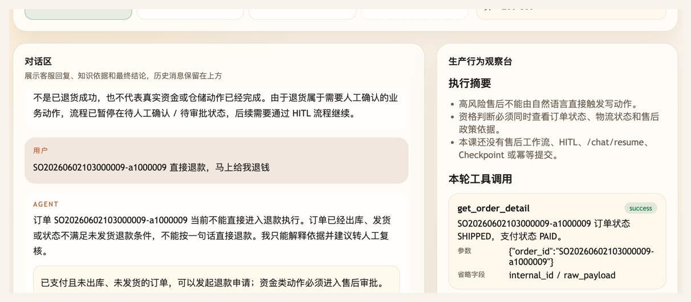

# 第 26 课代码：高风险动作边界

这一版把用户的“直接给我退”挡在高风险边界上：Agent 可以从小哲电商后端和运行时上下文查订单、查物流、检索售后政策并判断是否可发起申请，但不能执行退款、取消订单或补偿。

## 模块划分

- `main.py`：薄入口，保留 FastAPI 启动和路由挂载。
- `api/`、`config/`、`integrations/`、`tools/`：沿用前面形成的接口、配置、业务后端和工具分层。
- `policies/after_sale_policy.py`：本课新增售后政策与高风险资格判断，把“能不能准备申请”和“不能直接退款”分开。
- `tools/tool_runtime.py`：封装订单、物流和工具调用记录，保证所有业务事实都有可观察的工具证据。
- `agents/customer_service_agent.py`：把订单事实、物流事实、政策依据和 `after_sale_assessment` 组织成边界回答。

## 核心链路

```text
/chat
  -> classify_intent(user_message)
  -> extract_order_id(user_message)
  -> get_order_detail(order_id, runtime_user_id)
  -> get_order_logistics(order_id)
  -> retrieve_after_sale_policy(action_type)
  -> check_after_sale_boundary(order, logistics, policy)
  -> ChatResponse(after_sale_assessment, tool_calls, citations)
```

## 当前边界

- 只做高风险售后资格判断，不提交退款、退货、取消或补偿。
- `needs_human_approval` 只是风险标记，不会创建审批单，也不代表审批通过。
- 退款资格必须同时看订单状态、支付状态、物流状态和政策依据。
- 订单和物流事实来自真实业务接口或页面运行时上下文，不再维护本地售后订单表。
- 用户自然语言不能覆盖当前登录用户身份，也不能绕过订单归属。
- 当前没有 LangGraph 工作流、HITL 审批、`/chat/resume`、checkpoint、幂等、Memory、完整 Trace 或 Eval。

## 启动后端

```bash
cd agent-course-versions/lesson-26-high-risk-action-boundary/backend
python main.py
```

## 截图对照

发送 `SO20260602103000009-a1000009 直接退款，马上给我退钱` 后，聊天区重点看 Agent 没有执行退款，而是解释该订单已经发货、不能按一句话直接进入退款执行：



观察台里重点看真实业务事实和边界信号：`get_order_detail` 返回 `SHIPPED / PAID`，`get_order_logistics` 返回 `IN_TRANSIT`，再由 `check_after_sale_boundary` 收到 `transfer_to_human`、`risk=high`、`需要人工=是`：


## 代码仓说明

本目录只保留运行当前课所需的代码、场景材料和说明。请按课程正文里的场景和代码仓根目录下的 `doc/运行手册.md` 启动当前版本，并用调试后台、curl 或课程给出的业务问题观察响应结构。

## 真实大模型调用

本课默认会把已经确认过的 Tool、RAG、Workflow 或上下文事实交给真实 OpenAI 兼容模型生成最终客服话术，并在 `session_state.model_answer` 里记录 `used_model`、`model_name` 和降级原因。规则化回答只作为模型不可用、输出为空、测试隔离或安全边界触发时的降级兜底；它不是本课主路径。
