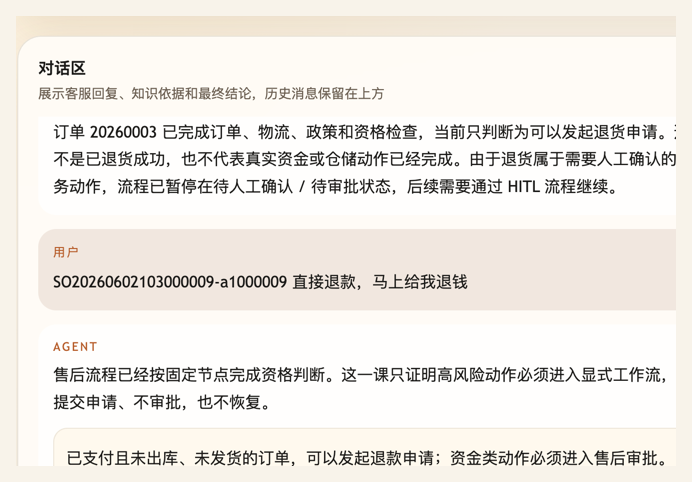
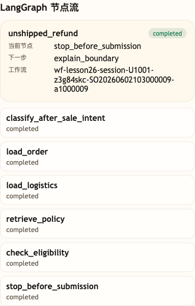

# 第 27 课代码：LangGraph 售后工作流

这一版把高风险售后从自由 Agent 路径里拆出来，用 LangGraph `StateGraph` 固定节点顺序，并在节点里读取小哲电商后端和运行时上下文里的真实订单、物流事实。

## 模块划分

- `main.py`：薄入口，保留 FastAPI 启动和路由挂载。
- `api/`、`config/`、`integrations/`、`tools/`、`policies/`：沿用第 26 课的接口、业务事实、工具记录和售后政策分层。
- `workflows/after_sale_workflow.py`：本课新增 LangGraph `StateGraph`，把售后意图分类、查订单、查物流、查政策、资格判断和停止提交固定成节点流。
- `agents/customer_service_agent.py`：不再让自由 Agent 直接处理高风险售后，而是调用 `AfterSaleWorkflow` 后再组装公开响应。

## 核心链路

```text
/chat
  -> AfterSaleWorkflow.run(request)
  -> StateGraph.classify_after_sale_intent
  -> StateGraph.load_order
  -> StateGraph.load_logistics
  -> StateGraph.retrieve_policy
  -> StateGraph.check_eligibility
  -> StateGraph.stop_before_submission
  -> ChatResponse(workflow, after_sale_assessment)
```

## 当前边界

- StateGraph 固定售后节点，不让模型自由决定先查什么、跳过什么。
- 工作流只做订单、物流、政策、资格判断和边界说明。
- 订单和物流事实来自真实业务接口或页面运行时上下文，不再维护本地售后订单表。
- 当前没有审批单、HITL、`/chat/resume`、checkpoint、幂等、Memory、完整 Trace 或 Eval。
- 未发货退款和签收后退货的细节会在后续两课分别加厚。

## 启动后端

```bash
cd agent-course-versions/lesson-27-langgraph-workflow/backend
python main.py
```

## 截图对照

发送 `SO20260602103000009-a1000009 直接退款，马上给我退钱` 后，聊天区重点看 Agent 没有自由发挥执行退款，而是说明高风险动作必须进入显式工作流，本课只完成资格判断并停止提交：



观察台里重点看 `LangGraph 节点流`：工作流停在 `stop_before_submission`，下一步是 `explain_boundary`，说明高风险售后被固定节点接管，而不是由模型随意决定节点顺序：



## 代码仓说明

本目录只保留运行当前课所需的代码、场景材料和说明。请按课程正文里的场景和代码仓根目录下的 `doc/运行手册.md` 启动当前版本，并用调试后台、curl 或课程给出的业务问题观察响应结构。

## 真实大模型调用

本课默认会把已经确认过的 Tool、RAG、Workflow 或上下文事实交给真实 OpenAI 兼容模型生成最终客服话术，并在 `session_state.model_answer` 里记录 `used_model`、`model_name` 和降级原因。规则化回答只作为模型不可用、输出为空、测试隔离或安全边界触发时的降级兜底；它不是本课主路径。
