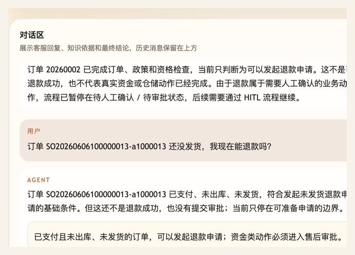
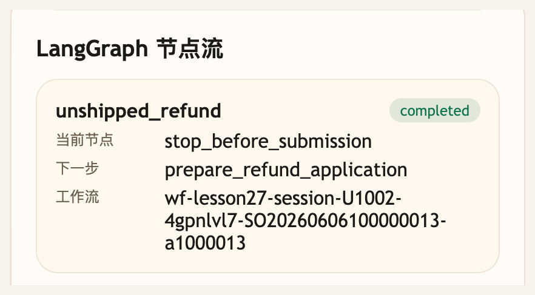

# 第 28 课代码：未发货退款流程

这一版只开放未发货退款路径。Agent 会从小哲电商后端和运行时上下文先查订单，再查物流和售后政策，最后判断是否可以准备退款申请。

## 模块划分

- `main.py`：薄入口，保留 FastAPI 启动和路由挂载。
- `api/`、`config/`、`integrations/`、`tools/`、`policies/`：沿用第 27 课之前形成的接口、业务事实、工具记录和售后政策分层。
- `workflows/after_sale_workflow.py`：在第 27 课固定节点的基础上收窄为未发货退款路径，只把符合条件的订单推进到 `prepare_refund_application`。
- `agents/customer_service_agent.py`：读取 workflow 状态和资格判断，明确告诉用户“可准备申请”不等于退款成功。

## 核心链路

```text
/chat
  -> AfterSaleWorkflow.run(request)
  -> classify_after_sale_intent
  -> load_order
  -> load_logistics
  -> retrieve_policy
  -> check_eligibility
  -> stop_before_submission
  -> ChatResponse(workflow.pending_action = prepare_refund_application)
```

## 当前边界

- 只处理已支付、未出库、未发货订单的退款资格。
- 已发货订单不能走未发货退款路径。
- 订单和物流事实来自真实业务接口或页面运行时上下文，不再维护本地售后订单表。
- 签收后退货流程还未开放。
- 当前不提交退款申请、不生成审批单、不开放 `/chat/resume`、checkpoint 或幂等。

## 启动后端

```bash
cd agent-course-versions/lesson-28-unshipped-refund-workflow/backend
python main.py
```

## 截图对照

发送 `订单 SO20260606100000013-a1000013 还没发货，我现在能退款吗？` 后，聊天区重点看 Agent 只判断为可以发起未发货退款申请，并明确这不是退款成功、也没有提交审批：



观察台里重点看 `LangGraph 节点流`：`unshipped_refund` 停在 `stop_before_submission`，下一步是 `prepare_refund_application`，说明本课只到“可准备申请”的边界：



## 代码仓说明

本目录只保留运行当前课所需的代码、场景材料和说明。请按课程正文里的场景和代码仓根目录下的 `doc/运行手册.md` 启动当前版本，并用调试后台、curl 或课程给出的业务问题观察响应结构。

## 真实大模型调用

本课默认会把已经确认过的 Tool、RAG、Workflow 或上下文事实交给真实 OpenAI 兼容模型生成最终客服话术，并在 `session_state.model_answer` 里记录 `used_model`、`model_name` 和降级原因。规则化回答只作为模型不可用、输出为空、测试隔离或安全边界触发时的降级兜底；它不是本课主路径。
