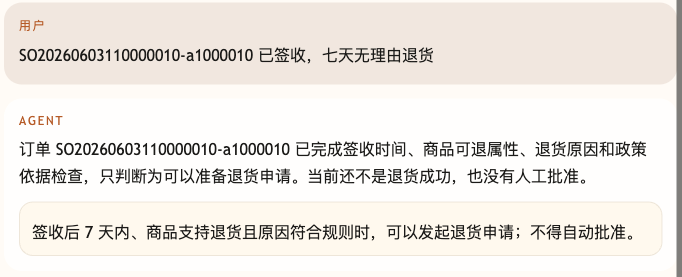
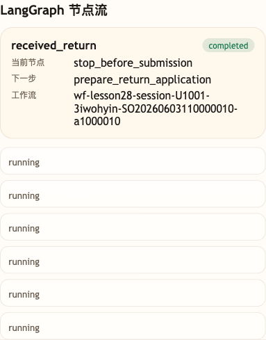

# 第 29 课代码：签收后退货流程

这一版在未发货退款之外加入签收后退货流程。Agent 会从小哲电商后端和运行时上下文检查订单是否签收、签收距今天数、商品是否支持退货、用户原因是否符合政策。

## 模块划分

- `main.py`：薄入口，保留 FastAPI 启动和路由挂载。
- `api/`、`config/`、`integrations/`、`tools/`、`policies/`：沿用前面形成的接口、配置、业务事实、工具记录和售后政策分层。
- `workflows/after_sale_workflow.py`：在第 28 课未发货退款路径之外，新增签收后退货路径，并把两条路径都停在提交申请前。
- `agents/customer_service_agent.py`：读取 workflow 状态和资格判断，向用户解释为什么“可准备申请”还不是退款或退货成功。

## 核心链路

```text
/chat
  -> AfterSaleWorkflow.run(request)
  -> classify_after_sale_intent
  -> load_order
  -> load_logistics
  -> retrieve_policy
  -> check_eligibility
  -> stop_before_submission
  -> ChatResponse(workflow.pending_action = prepare_return_application)
```

## 当前边界

- 未发货退款和签收后退货都只判断是否可准备申请。
- 签收后退货必须看签收时间、商品可退属性、退货原因和政策依据。
- 订单、签收时间和商品可退属性来自真实业务接口或页面运行时上下文，不再维护本地售后订单表。
- 当前不提交退款或退货申请，不生成审批单，不开放 `/chat/resume`、checkpoint 或幂等。

## 启动后端

```bash
cd agent-course-versions/lesson-29-received-return-workflow/backend
python main.py
```

## 截图对照

发送 `SO20260603110000010-a1000010 已签收，七天无理由退货` 后，聊天区重点看 Agent 同时核对签收时间、商品可退属性、退货原因和政策依据，只判断为可以准备退货申请：



观察台里重点看 `LangGraph 节点流`：`workflow_type` 是 `received_return`，下一步是 `prepare_return_application`，说明签收后退货没有混进未发货退款路径：



## 代码仓说明

本目录只保留运行当前课所需的代码、场景材料和说明。请按课程正文里的场景和代码仓根目录下的 `doc/运行手册.md` 启动当前版本，并用调试后台、curl 或课程给出的业务问题观察响应结构。

## 真实大模型调用

本课默认会把已经确认过的 Tool、RAG、Workflow 或上下文事实交给真实 OpenAI 兼容模型生成最终客服话术，并在 `session_state.model_answer` 里记录 `used_model`、`model_name` 和降级原因。规则化回答只作为模型不可用、输出为空、测试隔离或安全边界触发时的降级兜底；它不是本课主路径。
