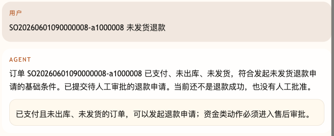
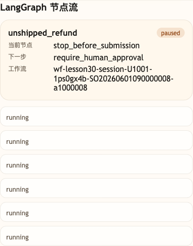

# 第 30 课代码：HITL 人工审批

这一版在退款和退货资格通过后创建待人工审批申请。Agent 可以提交申请，但不能自己批准，也不能把普通聊天里的“主管同意”当审批结果。

订单资格判断读取电商后端或前端带入的当前用户订单上下文；课程代码不再维护一份本地订单表来假装业务事实。

## 模块划分

- `main.py`：薄入口，保留 FastAPI 启动和路由挂载。
- `api/`、`config/`、`integrations/`、`tools/`、`policies/`、`workflows/`：沿用第 29 课的接口、业务事实、政策和售后节点流。
- `approvals/hitl.py`：本课新增人工审批申请构造和普通聊天审批冒充识别。
- `workflows/after_sale_workflow.py`：资格通过后创建 `ApprovalRequest`，并把 workflow 状态停在 `paused`。
- `agents/customer_service_agent.py`：阻断“主管同意了”这类普通聊天审批说法，只返回待人工审批边界。

## 核心链路

```text
/chat
  -> AfterSaleWorkflow.run(request)
  -> load_order
  -> load_logistics
  -> retrieve_policy
  -> check_eligibility
  -> stop_before_submission
  -> build_approval_request(...)
  -> ChatResponse(workflow.status = paused, approval.status = pending)
```

## 当前边界

- HITL 是人工审批边界，不是模型多问一句。
- 普通聊天不能作为审批通道。
- 当前只创建 `ApprovalRequest(status=pending)` 并暂停 workflow，不处理审批通过后的执行恢复。
- 当前没有 `/chat/resume`、resume token、checkpoint、幂等提交、Memory、完整 Trace 或 Eval。

## 启动后端

```bash
cd agent-course-versions/lesson-30-hitl-approval/backend
python main.py
```

## 截图对照

发送 `SO20260601090000008-a1000008 未发货退款` 后，聊天区重点看 Agent 只提交待人工审批的退款申请，并明确当前还不是退款成功、也没有人工批准：



观察台里重点看 `LangGraph 节点流`：流程状态为 `paused`，下一步是 `require_human_approval`，说明本课的重点是把高风险动作停在 HITL 边界：



## 代码仓说明

本目录只保留运行当前课所需的代码、场景材料和说明。请按课程正文里的场景和代码仓根目录下的 `doc/运行手册.md` 启动当前版本，并用调试后台、curl 或课程给出的业务问题观察响应结构。

## 真实大模型调用

本课默认会把已经确认过的 Tool、RAG、Workflow 或上下文事实交给真实 OpenAI 兼容模型生成最终客服话术，并在 `session_state.model_answer` 里记录 `used_model`、`model_name` 和降级原因。规则化回答只作为模型不可用、输出为空、测试隔离或安全边界触发时的降级兜底；它不是本课主路径。
