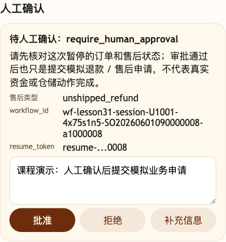
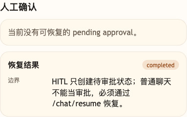

# 第 31 课代码：Resume、Checkpoint 与幂等

这一版在 HITL 暂停点保存 checkpoint，并开放 `/chat/resume`。恢复时必须校验 `workflow_id`、`resume_token`、冻结字段、业务事实二次校验和幂等键。

订单、物流和恢复前后的业务事实来自电商后端或前端带入的当前用户订单上下文；电商后端会补齐 SO202606 这组故事课演示订单，方便课堂展示。

## 模块划分

- `main.py`：薄入口，保留 FastAPI 启动和路由挂载。
- `api/routes.py`：在 `/chat` 之外新增 `/chat/resume`，把恢复协议和普通聊天通道分开。
- `workflows/after_sale_workflow.py`：暂停审批时生成 `resume_token`、`idempotency_key` 和冻结字段。
- `state/checkpoints.py`：本课新增 checkpoint、业务事实二次校验和幂等提交模拟。
- `approvals/hitl.py`：继续负责人工审批申请构造，不直接做恢复提交。
- `agents/customer_service_agent.py`：负责审批恢复入口编排，具体令牌、角色、业务事实复核和幂等重放由 `state/checkpoints.py` 集中处理。

## 核心链路

```text
/chat
  -> AfterSaleWorkflow.run(request)
  -> build_approval_request(...)
  -> freeze_workflow_fields(...)
  -> save_checkpoint(session_id, workflow_id)
  -> ChatResponse(workflow_id, resume_token, idempotency_key)

/chat/resume
  -> load checkpoint by session_id + workflow_id
  -> validate resume_token
  -> validate reviewer_role
  -> recheck_business_facts(frozen_fields)
  -> submit_after_sale_action(idempotency_key)
  -> ChatResumeResponse(resume_result, business_recheck)
```

## 当前边界

- `/chat/resume` 只服务 HITL 审批恢复，不是普通聊天续写。
- 恢复时不能让新消息覆盖 checkpoint 里的订单、用户、金额、政策和资格字段。
- 业务事实变化时阻断提交，避免上下文漂移。
- 重复恢复命中同一幂等键，不重复提交业务申请。
- 当前不做 Memory、Runtime Context 体系、Context Builder、Prompt Injection 防护、完整 Trace、Eval 或成本治理。

## 启动后端

```bash
cd agent-course-versions/lesson-31-resume-checkpoint-idempotency/backend
python main.py
```

## 截图对照

发送 `SO20260601090000008-a1000008 未发货退款` 后，观察台里先看 `人工确认`：它展示 `workflow_id` 和脱敏后的 `resume_token`，说明暂停点不是普通聊天状态，而是可恢复的 checkpoint：



点击 `批准` 后，再看同一个 `人工确认` 区域里的恢复结果：恢复只能通过 `/chat/resume`，并且提交的是模拟业务申请，不代表真实资金已经退款：



## 代码仓说明

本目录只保留运行当前课所需的代码、场景材料和说明。请按课程正文里的场景和代码仓根目录下的 `doc/运行手册.md` 启动当前版本，并用调试后台、curl 或课程给出的业务问题观察响应结构。

## 真实大模型调用

本课默认会把已经确认过的 Tool、RAG、Workflow 或上下文事实交给真实 OpenAI 兼容模型生成最终客服话术，并在 `session_state.model_answer` 里记录 `used_model`、`model_name` 和降级原因。规则化回答只作为模型不可用、输出为空、测试隔离或安全边界触发时的降级兜底；它不是本课主路径。
