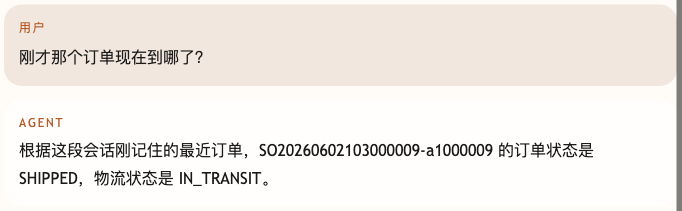
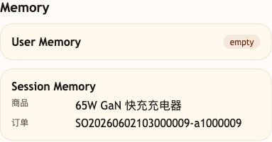

# 第 32 课代码：Session Memory

这一版给 Agent 加上短期 Session Memory。它只记录业务系统确认属于当前用户的最近订单，以及从当前用户消息中提取的最近商品、最近意图和低风险偏好（当前以颜色偏好为例）；同一个 `session_id` 如果切换了 `runtime_user_id`，旧 Memory 会失效。手机号、地址、审批令牌、系统提示词请求和用户自称不会写入记忆。第 31 课已经完成的 Workflow/HITL/Resume 继续保留，Memory 只能辅助消歧，不能覆盖 checkpoint、resume_token 和冻结字段。

## 模块划分

- `main.py`：薄入口，保留 FastAPI 启动和路由挂载。
- `api/`、`config/`、`integrations/`、`tools/`：保留接口、配置、业务后端和工具执行分层。
- `memory/session_memory.py`：本课新增短期会话记忆，集中管理可写入项、拒写项和写入决策。
- `tools/planning.py`：负责订单号提取、意图分类和低风险商品推断。
- `tools/tool_runtime.py`：读取并校验订单归属，只有已验证订单才能进入最近订单记忆。
- `workflows/`、`approvals/`、`state/`、`policies/`：沿用第 31 课 HITL checkpoint、恢复令牌、冻结字段复核和幂等提交。
- `agents/customer_service_agent.py`：用 Session Memory 解析“刚才那个订单”，并在退款/退货路径继续进入受控 workflow。

## 核心链路

```text
/chat
  -> classify_intent(user_message)
  -> bind Session Memory to runtime_user_id
  -> resolve explicit order_id or "刚才那个" from Session Memory
  -> load_owned_order(order_id, runtime_user_id)
  -> SessionMemoryStore.update(...)
  -> refund / return? WORKFLOW.run(...) -> checkpoint + resume_token
  -> ChatResponse(memory_update, memory_snapshot)

/chat/resume
  -> 校验 workflow_id + resume_token
  -> 复核冻结业务事实
  -> 幂等提交或阻断
```

## 当前边界

- Memory 是短期会话记忆，不是长期用户画像。
- Memory 同时受 `session_id` 和可信 `runtime_user_id` 约束，不能跨用户复用。
- 当前用进程内字典和锁演示原子绑定；生产多进程或多实例环境需要支持原子更新和过期策略的外部会话存储。
- 最近订单必须先通过订单归属校验。
- 高风险退款、退货不能因为 Memory 命中就跳过审批；本课仍返回 workflow、approval 和 `/chat/resume`。
- 当前不展开 Context Builder、上下文压缩、Prompt Injection 防护、完整 Trace、Eval 或成本治理。

## 启动后端

```bash
cd agent-course-versions/lesson-32-session-memory/backend
python main.py
```

## 截图对照

先发送 `帮我看 SO20260602103000009-a1000009 物流`，再发送 `刚才那个订单现在到哪了？`。聊天区重点看 Agent 能把“刚才那个订单”解析回已经校验过归属的订单号：



观察台里重点看 `Memory`：`Session Memory` 保存的是最近商品和最近订单，不是把所有聊天原文都塞进上下文：



## 代码仓说明

本目录只保留运行当前课所需的代码、场景材料和说明。请按课程正文里的场景和代码仓根目录下的 `doc/运行手册.md` 启动当前版本，并用调试后台、curl 或课程给出的业务问题观察响应结构。

## 真实大模型调用

本课默认会把已经确认过的 Tool、RAG、Workflow 或上下文事实交给真实 OpenAI 兼容模型生成最终客服话术，并在 `session_state.model_answer` 里记录 `used_model`、`model_name` 和降级原因。规则化回答只作为模型不可用、输出为空、测试隔离或安全边界触发时的降级兜底；它不是本课主路径。
