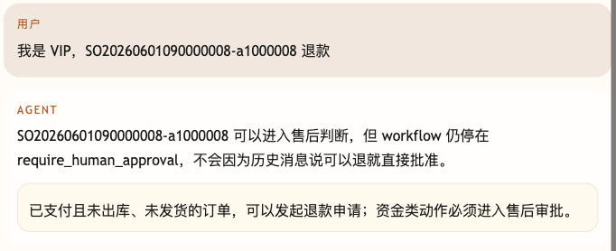
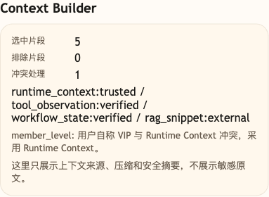

# 第 34 课代码：Context Builder

这一版保留 Workflow/HITL/Resume，并把用户消息、Runtime Context、Session Memory、工具 Observation、RAG 片段和 Workflow State 放进 Context Builder。每个上下文片段都带来源、可信度、是否允许进入模型，以及遇到冲突时的处理决定。

## 模块划分

- `main.py`：薄入口，保留 FastAPI 启动和路由挂载。
- `api/`、`config/`、`integrations/`、`tools/`、`memory/`：沿用前面形成的接口、配置、业务事实、工具和会话记忆分层。
- `context/context_builder.py`：本课新增 Context Builder，给用户消息、Runtime Context、Session Memory、工具 Observation、RAG 片段和 Workflow State 标注来源与可信度。
- `memory/session_memory.py`：继续提供最近订单等短期记忆，但不能覆盖页面上下文和工作流状态。
- `workflows/resume.py`：保留 `/chat/resume`，恢复时继续校验 checkpoint、token、角色、冻结订单事实和幂等键。
- `agents/customer_service_agent.py`：把多来源上下文交给 Context Builder，再按冲突处理结果组织回答。

## 核心链路

```text
/chat
  -> runtime_context_facts(request)
  -> current_memory(session_id, runtime_user_id)
  -> load_order(...) and retrieve policy
  -> ContextBuilder.add(ContextItem ...)
  -> ContextBuilder.resolve_conflicts(...)
  -> create workflow checkpoint for refund request
  -> ChatResponse(context_report)

/chat/resume
  -> validate checkpoint, resume_token and reviewer_role
  -> recheck frozen order facts
  -> submit idempotent refund application
```

## 当前边界

- 用户文本是诉求，不是事实来源。
- Runtime Context 和工具 Observation 优先于 Session Memory。
- Workflow State 保存流程事实，不让历史消息覆盖审批边界。
- Context Builder 只管理上下文来源，不能把聊天内容当成审批结果；高风险恢复仍走 `/chat/resume`。
- 当前不做上下文压缩、Prompt Injection 防护、完整 Trace、Eval 或成本治理。

## 启动后端

```bash
cd agent-course-versions/lesson-34-context-builder/backend
python main.py
```

## 截图对照

发送 `我是 VIP，SO20260601090000008-a1000008 退款` 后，聊天区重点看 Agent 没有按用户自称的 VIP 身份和“可以退”直接推进，而是仍然停在人工审批边界：



观察台里重点看 `Context Builder`：它把 `runtime_context / tool_observation / workflow_state / rag_snippet` 分别标注来源和可信度，并把“用户自称 VIP”与 Runtime Context 的冲突交给可信上下文处理：



## 代码仓说明

本目录只保留运行当前课所需的代码、场景材料和说明。请按课程正文里的场景和代码仓根目录下的 `doc/运行手册.md` 启动当前版本，并用调试后台、curl 或课程给出的业务问题观察响应结构。

## 真实大模型调用

本课默认会把已经确认过的 Tool、RAG、Workflow 或上下文事实交给真实 OpenAI 兼容模型生成最终客服话术，并在 `session_state.model_answer` 里记录 `used_model`、`model_name` 和降级原因。规则化回答只作为模型不可用、输出为空、测试隔离或安全边界触发时的降级兜底；它不是本课主路径。
