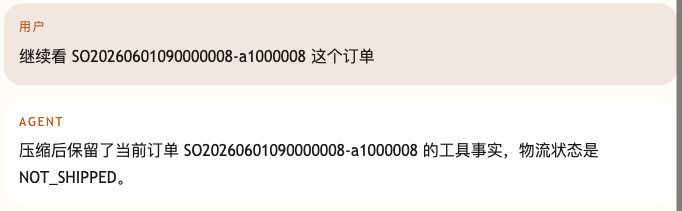
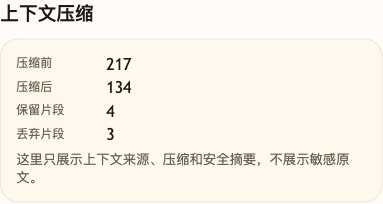

# 第 35 课代码：上下文压缩与 Sliding Window

这一版保留 Workflow/HITL/Resume，并在 Context Builder 之后增加压缩和窗口选择。它保留可信系统上下文、当前订单工具事实、RAG 政策片段和 workflow 状态；最近消息通过 Sliding Window 保留；中间历史如果命中当前订单号，也会因为相关性被保留。

## 模块划分

- `api/`：FastAPI 路由和 Pydantic 契约，入口仍然很薄。
- `agents/`：客服 Agent 编排层，负责把意图、上下文候选和回答组装起来。
- `context/`：本课新增的上下文压缩层，集中处理 protected context、Sliding Window 和丢弃摘要。
- `state/`：保存课程用的会话记忆、消息计数和高风险 workflow checkpoint；会话记忆同时校验 `runtime_user_id`，再进入压缩候选。
- `workflows/`：保留 `/chat/resume`，说明压缩策略不能裁掉暂停中的高风险流程。
- `rag/`、`tools/`、`integrations/`：沿用前面课程拆出的知识检索、工具规划和业务后端集成。

## 核心链路

```text
/chat
  -> build history/runtime/memory/tool/rag/workflow candidates
  -> score by Context Relevance
  -> keep protected items and recent sliding window
  -> summarize dropped old history
  -> keep workflow checkpoint outside model context
  -> ChatResponse(compression_report)

/chat/resume
  -> validate checkpoint, resume_token and reviewer_role
  -> recheck frozen order facts
  -> submit idempotent refund application
```

## 当前边界

- 压缩不是把所有历史简单截断。
- Workflow State、Runtime Context 和工具事实不能被旧聊天挤掉。
- `/chat/resume` 依赖服务端 checkpoint，不依赖压缩后的聊天摘要。
- 旧闲聊只进入公开摘要，不保留原文。
- 当前不做 Prompt Injection 防护、完整 Trace、Eval 或成本治理。

## 启动后端

```bash
cd agent-course-versions/lesson-35-context-compression/backend
python main.py
```

## 截图对照

发送 `继续看 SO20260601090000008-a1000008 这个订单` 后，聊天区重点看 Agent 没有被长历史挤掉当前订单，仍然保留了该订单的工具事实：



观察台里重点看 `上下文压缩`：压缩前后 token 估算、保留片段和丢弃片段都被公开展示，说明本课不是简单截断历史，而是按保护项、最近窗口和相关性选择上下文：



## 代码仓说明

本目录只保留运行当前课所需的代码、场景材料和说明。请按课程正文里的场景和代码仓根目录下的 `doc/运行手册.md` 启动当前版本，并用调试后台、curl 或课程给出的业务问题观察响应结构。

## 真实大模型调用

本课默认会把已经确认过的 Tool、RAG、Workflow 或上下文事实交给真实 OpenAI 兼容模型生成最终客服话术，并在 `session_state.model_answer` 里记录 `used_model`、`model_name` 和降级原因。规则化回答只作为模型不可用、输出为空、测试隔离或安全边界触发时的降级兜底；它不是本课主路径。
