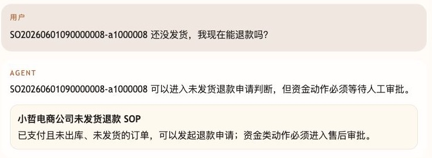
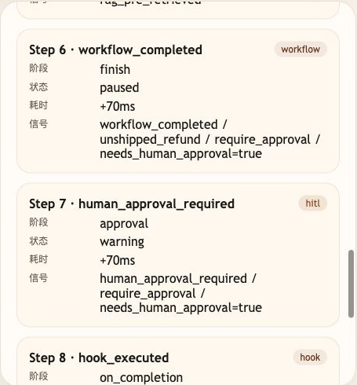

# 第 37 课代码：Trace 可观测

这一版在第八幕安全边界之后增加公开 Trace。Agent 会保留前序 Workflow/HITL/`/chat/resume` 能力，并把 Runtime Context、Context、Tool、RAG、Workflow/HITL、Hooks 和 Cost 记录成 `trace_event_v1`，供调试和评测复盘。

## 模块划分

- `api/`：新增 Trace 查询路由，并继续保留 `/chat/resume`，但仍然不直接写业务逻辑。
- `agents/`：在关键步骤写入 Trace，而不是把日志散落在路由里。
- `observability/`：本课新增的 TraceStore 和 Trace 事件清洗层，统一公开可观测结构。
- `tools/`：工具执行层开始记录 started/finished/error 事件。
- `rag/`、`integrations/`、`state/`：继续提供知识、业务事实和会话状态。

## 核心链路

```text
/chat
  -> classify_intent(user_message)
  -> TraceStore.add(runtime_context_built)
  -> TraceStore.add(context_built)
  -> get_order_detail(...) / get_order_logistics(...)
  -> retrieve refund policy when needed
  -> build workflow / HITL summary when needed
  -> TraceStore.add(cost_recorded)
  -> ChatResponse(session_state.trace)

/sessions/{session_id}/trace
  -> TraceStore.list(session_id)
  -> list[TraceEvent]

/chat/resume
  -> 校验 resume_token
  -> business_recheck(checkpoint)
  -> workflow_resumed / human_approval_resolved trace
```

## 当前边界

- Trace 只展示公开执行摘要，不展示 hidden CoT。
- Trace payload 会脱敏系统提示词、密钥、手机号、地址和 protected reasoning 文本。
- Trace 可以记录 cost 事件，但这一课不展开完整 `cost_summary` 成本治理。
- Workflow/HITL/Resume 是上一幕已经完成的能力，本课只给它补公开 trace，不关闭恢复入口。
- 当前没有 `/eval/run`、失败归因、反馈回填或成本分层治理。

## 启动后端

```bash
cd agent-course-versions/lesson-37-trace-observability/backend
python main.py
```

## 截图对照

发送 `SO20260601090000008-a1000008 还没发货，我现在能退款吗？` 后，回答只判断“可以进入申请判断”，并引用未发货退款 SOP，不把资金动作说成已经完成：



Trace 事件里重点看 `workflow_completed` 停在 `paused`，以及 `human_approval_required` 明确标记 `needs_human_approval=true`：



## 代码仓说明

本目录只保留运行当前课所需的代码、场景材料和说明。请按课程正文里的场景和代码仓根目录下的 `doc/运行手册.md` 启动当前版本，并用调试后台、curl 或课程给出的业务问题观察响应结构。

## 真实大模型调用

本课默认会把已经确认过的 Tool、RAG、Workflow 或上下文事实交给真实 OpenAI 兼容模型生成最终客服话术，并在 `session_state.model_answer` 里记录 `used_model`、`model_name` 和降级原因。规则化回答只作为模型不可用、输出为空、测试隔离或安全边界触发时的降级兜底；它不是本课主路径。
