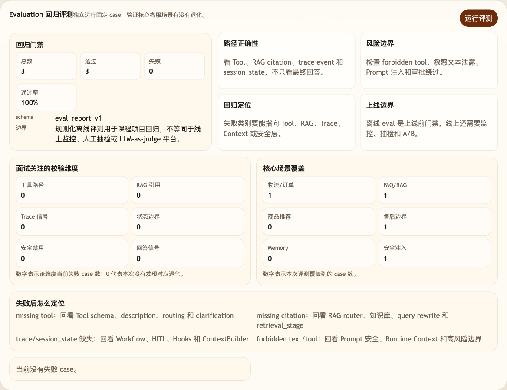

# 第 38 课代码：Evaluation 回归评测

这一版在公开 Trace 之上增加 `/eval/run`。Eval 会读取本课 `cases.yml`，调用真实 Agent 链路，再检查 `answer`、`tool_calls`、`citations`、`trace`、`session_state` 和 `workflow`。前序 Workflow/HITL/`/chat/resume` 继续保留，评测只是新增回归检查入口。

## 模块划分

- `api/`：新增 `/eval/run`，继续保留 `/chat/resume`，让评测成为后端能力的一部分。
- `evals/`：本课新增评测执行层，读取 `cases.yml` 并检查回答、工具、引用、Trace 和状态。
- `observability/`：为 Eval 提供公开 Trace 证据，避免评测依赖 hidden reasoning。
- `agents/`、`tools/`、`rag/`：沿用真实 Agent 链路，评测不伪造模型或工具结果。

## 核心链路

```text
/eval/run
  -> EvalRunner.load_cases(cases.yml)
  -> Lesson38Agent.chat(ChatRequest)
  -> TraceStore.list(session_id)
  -> compare answer / tool_calls / citations / trace / session_state / workflow
  -> EvalRunResponse(eval_report_v1)
```

## 当前边界

- Evaluation 使用固定测试集和结构化路径断言，不是线上监控或人工抽检平台。
- Eval 不读取 hidden CoT，也不让测试伪造工具或业务接口结果。
- Eval 会检查 workflow 是否停在 HITL，也不关闭 `/chat/resume` 的恢复能力。
- 这一课只做回归评测，不做失败归因、反馈闭环或成本治理。

## 启动后端

```bash
cd agent-course-versions/lesson-38-evaluation-regression/backend
python main.py
```

## 截图对照

点击调试后台底部的 `运行评测` 后，重点看 `Evaluation 回归评测` 面板：它展示 `eval_report_v1`、固定 case 数、通过率、失败类别和核心场景覆盖，说明本课验证的是回答与中间路径，而不是只看一句最终回复：



## 代码仓说明

本目录只保留运行当前课所需的代码、场景材料和说明。请按课程正文里的场景和代码仓根目录下的 `doc/运行手册.md` 启动当前版本，并用调试后台、curl 或课程给出的业务问题观察响应结构。

## 真实大模型调用

本课默认会把已经确认过的 Tool、RAG、Workflow 或上下文事实交给真实 OpenAI 兼容模型生成最终客服话术，并在 `session_state.model_answer` 里记录 `used_model`、`model_name` 和降级原因。规则化回答只作为模型不可用、输出为空、测试隔离或安全边界触发时的降级兜底；它不是本课主路径。
