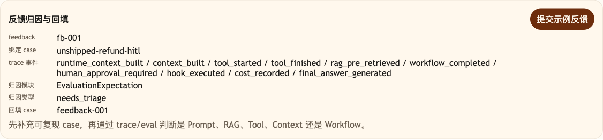

# 第 39 课代码：失败归因与反馈闭环

这一版在 Eval 基础上增加反馈提交和失败归因。用户差评会绑定同一会话的 Trace 和对应 Eval case，再归因到 Prompt、RAG、Tool、Context、Workflow 或测试期望。前序 Workflow/HITL/`/chat/resume` 继续保留，反馈闭环只是在事故之后补证据和回归 case。

## 模块划分

- `api/`：新增反馈提交路由，继续保留 `/chat/resume`，负责把请求接入反馈闭环。
- `feedback/`：本课新增失败归因层，把差评、Trace 和 Eval 失败类别映射到 Prompt、RAG、Tool、Context 或 Workflow。
- `evals/`：支持从反馈回填临时回归 case，形成“出错一次，下次自动测”的闭环。
- `observability/`、`agents/`、`tools/`：继续提供归因所需的执行证据。

## 核心链路

```text
/feedback/submit
  -> TraceStore.list(session_id)
  -> EvalRunner.run(case_id)
  -> FailureAttributor.attribute(...)
  -> build_backfilled_case(...)
  -> FeedbackSubmitResponse(record, eval_report)

/eval/run
  -> fixed cases.yml + feedback backfilled cases
```

## 当前边界

- 归因落到具体模块，不用“模型不好”当结论。
- 反馈回填的是课程用例，不是线上数据治理平台。
- 反馈归因可以指向 Workflow/HITL，但不能替代人工审批或 resume 恢复。
- 这一课不做成本分层、预算告警或完整 FinOps。

## 启动后端

```bash
cd agent-course-versions/lesson-39-failure-attribution-feedback/backend
python main.py
```

## 截图对照

先发送 `SO20260601090000008-a1000008 还没发货，我现在能退款吗？` 生成一次带 trace 的售后会话，再在 Evaluation 面板点击 `提交示例反馈`。重点看 `反馈归因与回填`：用户差评被绑定到当前会话、固定 eval case 和 trace 事件，再归因到具体模块并回填新 case：



## 代码仓说明

本目录只保留运行当前课所需的代码、场景材料和说明。请按课程正文里的场景和代码仓根目录下的 `doc/运行手册.md` 启动当前版本，并用调试后台、curl 或课程给出的业务问题观察响应结构。

## 真实大模型调用

本课默认会把已经确认过的 Tool、RAG、Workflow 或上下文事实交给真实 OpenAI 兼容模型生成最终客服话术，并在 `session_state.model_answer` 里记录 `used_model`、`model_name` 和降级原因。规则化回答只作为模型不可用、输出为空、测试隔离或安全边界触发时的降级兜底；它不是本课主路径。
