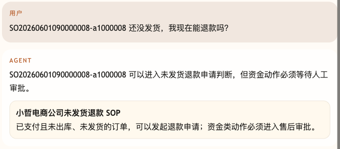
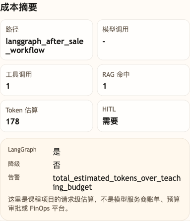

# 第 40 课代码：成本治理

这一版在可观测、评测和反馈闭环之后增加 `cost_summary_v1`。它区分轻路径、重路径和常见命中缓存，统计模型调用、RAG/Tool 次数、上下文 token、Prompt 片段和 Observation 压缩。前序 Workflow/HITL/`/chat/resume` 继续保留，成本治理不能为了省钱跳过恢复和审批边界。

## 模块划分

- `api/`：继续保留聊天、`/chat/resume`、Trace、Eval 和 Feedback 路由。
- `cost/`：本课新增成本治理层，集中计算路径分层、Prompt 片段、Observation 压缩和预算信号。
- `agents/`：在回答链路末尾写入 `cost_summary_v1`，但不绕过事实查询和 HITL。
- `evals/`、`feedback/`、`observability/`：让成本治理也能被评测、反馈和 Trace 观察到。

## 核心链路

```text
/chat
  -> classify_intent(user_message)
  -> run light path / workflow path / cached FAQ path
  -> selected_prompt_fragments(...)
  -> observation_compression(tool_calls)
  -> build_cost_summary(...)
  -> TraceStore.add(cost_recorded)
  -> ChatResponse(session_state.cost_summary)
```

## 当前边界

- 成本治理不跳过业务事实查询，不绕过 HITL。
- `/chat/resume` 的恢复路径也会记录轻量 `hitl_resume_path` 成本摘要，证明恢复不是重新跑一遍重链路。
- 常见 FAQ 可以命中缓存，高风险 workflow 不进入缓存 shortcut。
- 这一课不做完整 FinOps、真实账单系统、预算审批流或多团队成本中心。

## 启动后端

```bash
cd agent-course-versions/lesson-40-cost-governance/backend
python main.py
```

## 截图对照

发送 `SO20260601090000008-a1000008 还没发货，我现在能退款吗？` 后，聊天区重点看 Agent 仍然完整走未发货退款判断和人工审批边界，成本治理没有跳过业务事实或 HITL：



观察台里重点看 `成本摘要`：路径是 `langgraph_after_sale_workflow`，同时展示工具调用、RAG 命中、token 估算、HITL 和预算告警，说明本课做的是请求级成本分层观察：



## 代码仓说明

本目录只保留运行当前课所需的代码、场景材料和说明。请按课程正文里的场景和代码仓根目录下的 `doc/运行手册.md` 启动当前版本，并用调试后台、curl 或课程给出的业务问题观察响应结构。

## 真实大模型调用

本课默认会把已经确认过的 Tool、RAG、Workflow 或上下文事实交给真实 OpenAI 兼容模型生成最终客服话术，并在 `session_state.model_answer` 里记录 `used_model`、`model_name` 和降级原因。规则化回答只作为模型不可用、输出为空、测试隔离或安全边界触发时的降级兜底；它不是本课主路径。
