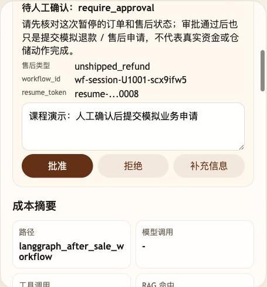
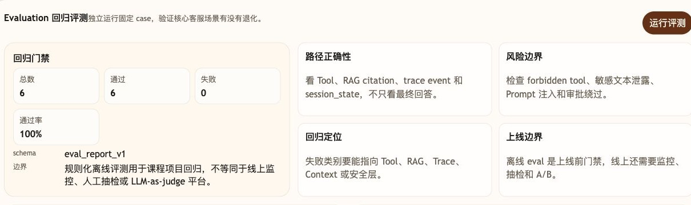
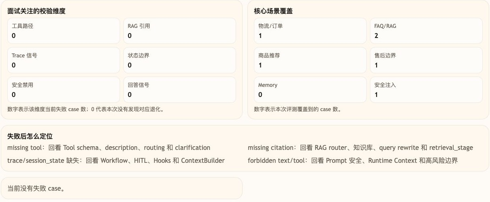

# 第 41 课代码：大促前夜总演习

这一版是第十幕的阶段性最终 Agent。它沿用第九幕后的 Trace、Evaluation、失败归因和成本治理能力，并把前面课程已经出现过的 Tool、RAG、Workflow/HITL、Resume、降级和安全拒绝放到同一个大促验证入口里。

## 模块划分

- `api/`：聊天、恢复、Trace、Eval 和 Feedback 路由；路由只负责接入，不写业务分支。
- `agents/`：第 41 课综合演练 Agent 编排层，串联 Tool、RAG、Workflow/HITL、降级、安全和成本治理。
- `models/router_client.py`：真实大模型路由层；配置 `AGENT_OPENAI_API_KEY` 后，由模型生成结构化 RoutePlan 候选，再交给服务端策略收敛。
- `models/answer_client.py`：真实大模型回答层；只基于 Tool Observation、RAG citations、Workflow 状态等受控事实生成最终客服话术。
- `tools/`、`integrations/`：订单详情、物流查询和小哲电商业务后端集成；实时事实由 Tool 和业务后端提供，不由模型推测。
- `rag/`：售后、发票、活动和会员规则的可引用知识片段；活动/会员规则会先形成候选池，再用课程版轻量 reranker 重排，保留第 14 课讲过的“候选池 -> 重排 -> citation”可观察链路。
- `workflows/`：HITL checkpoint、恢复令牌、冻结字段复核和幂等提交。
- `observability/`、`evals/`、`feedback/`、`cost/`：公开 Trace、回归评测、反馈归因和请求级成本治理。
- `state/`、`config/`：课程级内存状态与共享运行配置。

## 核心链路

```text
/chat
  -> classify_intent(user_message) 作为回退
  -> route_model_client.plan_route_candidate(...) 生成结构化 RoutePlan 候选
  -> Pydantic 严格校验 + Tool/知识域白名单 + 风险与 Workflow 边界收敛
  -> runtime_context_built / context_built
  -> Tool path / RAG path / Workflow-HITL path / degradation path / security path
  -> answer_model_client.compose_answer(...) 用受控事实生成最终客服话术
  -> build_cost_summary(...)
  -> trace_store.add(cost_recorded)
  -> ChatResponse(tool_calls, citations, session_state.workflow, session_state.trace, session_state.cost_summary)

/chat/resume
  -> 校验 workflow_id + resume_token
  -> 复核冻结业务事实
  -> 记录人工审批结果
  -> 返回 ChatResumeResponse

/eval/run
  -> 运行 cases.yml 中的大促回归场景
```

## 本课专属验证

- 物流查询：`SO20260602103000009-a1000009` 必须走 `get_order_detail` 和 `get_order_logistics`。
- 活动/会员规则：618 满减和金卡会员券必须走 RAG + reranker，并返回 `promotion_618_stack_rule`、`member_coupon_gold_rule` 引用，同时在 `session_state.rag` 和公开 trace 里记录重排信号。
- 大模型接入：配置真实 `AGENT_OPENAI_API_KEY` 时，路由模型会输出 8 字段结构化候选，并记录 `candidate_validated`、`candidate_applied` 和最终 `policy_constraints`；未配置或候选无效时保留课程可运行回退。
- 未发货退款：`SO20260601090000008-a1000008` 必须进入 workflow，停在 `require_approval`，并返回 `resume_token`。
- 审批恢复：`/chat/resume` 校验 checkpoint、恢复令牌和冻结字段，重复审批保持幂等。
- 综合兜底：服务超时走降级转人工，低置信活动规则不编造，安全请求不泄露受保护内容。

## 截图对照

未发货退款路径会停在 `require_approval`，并把 `resume_token`、`langgraph_after_sale_workflow` 和请求级成本摘要放在观察台里：



`/eval/run` 会同时检查答案、Tool、RAG citation、Trace、session_state 和 HITL 恢复边界。本次总演习 15 个 case 全部通过：原有 9 条大促主线保持不变，新增 6 条用于防止否定退款误路由、商品联合回答、退款进度、已发货退款、签收后退货和 FAQ 知识选择能力倒退。



评测维度里重点看失败数是否为 0，以及物流、RAG、售后审批、恢复令牌、幂等恢复、降级和安全注入这些核心场景是否被覆盖：



## 当前边界

- 这是课程级最终演练快照，不是完整生产 FinOps、工单系统、客服质检平台或线上监控平台。
- 最终版支持真实大模型调用；没有配置模型 Key 时，非 RAG 路径会用规则路由和确定性话术兜底。RAG 路径不会静默伪造语义检索，离线课堂或测试需明确开启下一条所述开关。
- RAG 默认通过 `AGENT_EMBEDDING_MODEL` 调用真实 OpenAI 兼容 Embedding。只有离线回归测试显式设置 `AGENT_COURSE_OFFLINE_RAG=1` 时才使用本地字符向量；调试状态会公开当前 embedding 模式，不把离线替身冒充成语义模型。
- 商品、订单和售后状态默认来自电商业务后端；Tool 参数中的 `fact_source=business_api` 可证明在线事实来源。只有独立设置 `AGENT_COURSE_OFFLINE_FACTS=1` 时，才允许使用与业务种子完全一致的 `course_seed_mirror`。`AGENT_COURSE_DISABLE_LLM=1` 只禁用模型，不会授权业务镜像，因此在线接口失败不会被镜像数据静默掩盖。
- 普通商品、订单、FAQ 和活动由模型候选参与规划；退款、退货、安全和故障降级仍经过确定性规则守卫，因为这些规则承担权限、安全和业务状态机边界，而不是替代普通自然语言理解。
- FAQ 使用用户原始问题执行 Hybrid RAG，再由知识域、排序分数和证据阈值选择 Citation；公共缓存按索引版本与 `policy_id` 隔离，只保存知识答案，不保存带用户身份的模型最终话术。
- 高风险退款只记录模拟审批结果，不执行真实资金退款。
- 第 46 课不继续新增主线 Agent 能力，只整理高级增强方向和项目表达。

## 启动后端

```bash
cd agent-course-versions/lesson-41-final-rehearsal/backend
python main.py
```

启动后端后，可以用 `/eval/run` 触发本课 15 条大促回归场景：

```bash
curl -s -X POST http://127.0.0.1:8000/eval/run
```

返回里的 `passed` 应为 15，`failed` 应为 0。这里检查的是 answer、Tool、RAG citation、Trace、session_state，以及 3 条审批恢复 / resume 场景，不只是最终话术。

## 代码仓说明

本目录只保留运行当前课所需的代码、场景材料和说明。请按课程正文里的场景和代码仓根目录下的 `doc/运行手册.md` 启动当前版本，并用调试后台、curl 或课程给出的业务问题观察响应结构。
