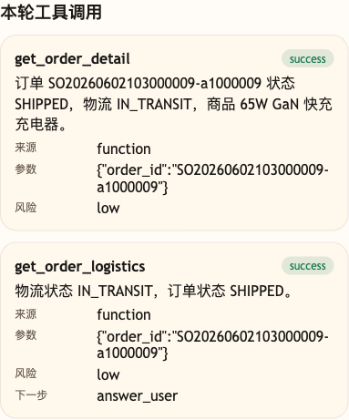
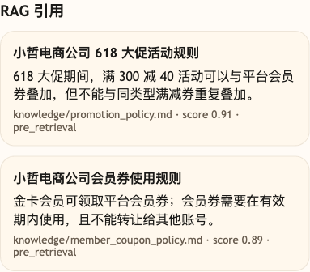

# 第 42 课代码说明：Tool 与 RAG 场景验证

本课不新增 Agent 能力，复用第 41 课综合演练版：

```text
agent-course-versions/lesson-41-final-rehearsal/backend/
```

第 42 课验证三类大促入口有没有走对路：

- 物流查询必须走实时业务 Tool：`get_order_detail`、`get_order_logistics`。
- 活动和会员规则必须走稳定知识 RAG：返回 `promotion_618_stack_rule`、`member_coupon_gold_rule` 引用。
- 商品综合咨询必须同时出现实时商品 Tool 和活动规则 citation，不能用 RAG 猜库存，也不能用 Tool 代替稳定规则。
- FAQ 类公开稳定知识首次查询且公共缓存未命中时，有模型配置才会由路由模型选路，再由最终话术模型把受控事实组织成自然客服回复。同一条 FAQ 知识命中缓存后，直接复用已验证的知识答案和 citation，最终话术模型不再调用。活动规则仍走 RAG，本课不宣称它会命中公共答案缓存。

## 本课场景材料

```text
scenario_tool_rag.json
```

你可以按课程正文启动第 41 课后端，再用 `scenario_tool_rag.json` 里的业务问题请求 `/chat`，并在调试后台或 `/sessions/{session_id}/trace` 里观察 `tool_calls`、`citations`、trace 和 `cost_summary`。

## 截图对照

发送 `请帮我查一下 SO20260602103000009-a1000009 的物流` 并打开 `工具调用` 后，观察台里重点看实时物流走 `get_order_detail` 和 `get_order_logistics`，没有把当前物流状态交给 RAG 猜：



发送 `618 大促满减和金卡会员券能不能叠加？` 并打开 `RAG 引用` 后，观察台里重点看活动规则和会员券规则来自知识库引用，而不是业务 Tool：



发送 `降噪耳机现在的标价、活动价和库存分别是多少？另外，平台 618 满减的一般规则是什么？` 后，同时检查 `search_products` 和 `promotion_618_stack_rule`：当前商品价格、库存来自业务 Tool，RAG 只说明平台通用规则，不承诺它一定适用于当前商品。

连续两次发送 `电子发票通常多久能准备好？`。第一次公共缓存未命中时，有模型配置才会显示路由模型和最终话术模型参与；没有模型配置时，走确定性课程回退，不宣称模型参与。本课自动化回归设置 `AGENT_COURSE_DISABLE_LLM=1`，因此首次请求的 `route_planner` 和 `final_answer` 也都是 `0`。第二次命中后，应看到 `common_hit_cache=true`、`path_type=cached_faq_light_path` 和 `model_calls.final_answer=0`。公共答案缓存位于路由之后，因此不能据此推断在线环境的 `model_calls.route_planner=0`。两次引用都来自 FAQ 知识，不靠模型编事实。

## 没有提前做的能力

- 不新增知识运营后台。
- 不接入完整 BM25 / ES。
- 不做 RAG Fusion 或多知识库权限过滤。
- 不让活动规则走 Tool，也不让物流实时状态走 RAG。

## 代码仓说明

本目录只保留运行当前课所需的代码、场景材料和说明。请按课程正文里的场景和代码仓根目录下的 `doc/运行手册.md` 启动当前版本，并用调试后台、curl 或课程给出的业务问题观察响应结构。
