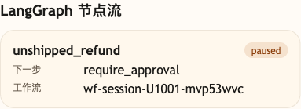
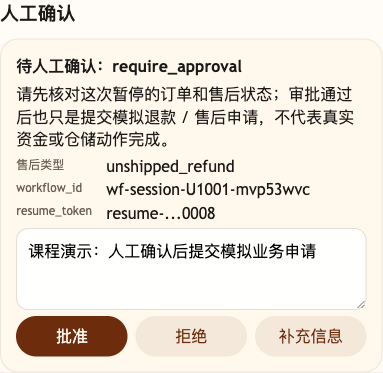

# 第 43 课代码说明：退款 Workflow 与 HITL 验证

本课不新增 Agent 能力，复用第 41 课综合演练版：

```text
agent-course-versions/lesson-41-final-rehearsal/backend/
```

第 43 课只验证大促退款链路：

- 未发货退款必须查订单事实和售后政策。
- workflow 必须暂停在 `require_approval`。
- `/chat/resume` 必须校验 `workflow_id`、`resume_token` 和冻结业务事实。
- 重复审批必须保持幂等。
- 模型可以生成自然客服话术，但不能批准退款、绕过 HITL 或改变冻结后的业务事实。

## 本课场景材料

```text
scenario_refund_hitl.json
```

你可以按课程正文启动第 41 课后端，再用 `scenario_refund_hitl.json` 里的业务问题观察 `/chat` 如何暂停在人工审批节点，以及 `/chat/resume` 如何校验 `workflow_id`、`resume_token` 和冻结后的订单事实。

## 截图对照

发送 `SO20260601090000008-a1000008 还没发货，我现在能退款吗？` 后，先看 `LangGraph 节点流`：未发货退款 workflow 暂停在 `require_approval`，没有直接执行退款：



再看 `人工确认`：这里展示 `workflow_id` 和脱敏 `resume_token`，说明后续恢复必须走专门的 HITL 恢复协议：



同时打开 `成本摘要`，模型配置可用时可以看到最终话术模型参与；但 workflow 的 `pending_action=require_approval` 不会因为模型话术而改变。

## 没有提前做的能力

- 不执行真实资金退款。
- 不做完整售后工单平台。
- 不把普通聊天当人工审批结果。
- 不让模型绕过 HITL 直接批准退款。

## 代码仓说明

本目录只保留运行当前课所需的代码、场景材料和说明。请按课程正文里的场景和代码仓根目录下的 `doc/运行手册.md` 启动当前版本，并用调试后台、curl 或课程给出的业务问题观察响应结构。
